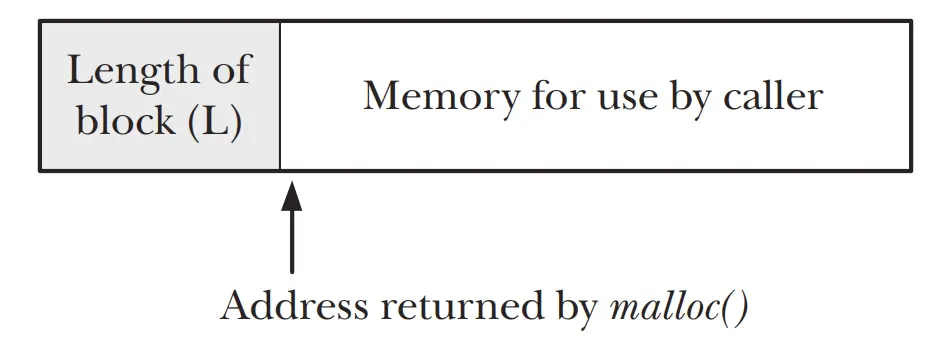

<b>C语言和C++中，为什么malloc函数需要传入申请的内存大小，而free时候却不需要传大小呢？</b>
  

>Looking at the implementation of free(), things start to become more interesting. When free() places a block of memory onto the free list, how does it know what
size that block is? This is done via a trick. When malloc() allocates the block, it allocates extra bytes to hold an integer containing the size of the block. This integer is
located at the beginning of the block; the address actually returned to the caller
points to the location just past this length value, as shown in Figure 7-1.
  

这里讲的就是在malloc返回的申请内存的首地址之前，用额外的字节存储了长度。

所以C语言有个要求就是free()传入的指针一定要是malloc返回的，而不能是其他的。

比如你用malloc申请了20个字节的内存，malloc返回指针p。你想用p+5传入free()，来释放掉后面15个字节内存，抱歉做不到，可能会出现段错误。因为该指针指向的位置前面的内存中的值，会被free视为之前申请的内存的大小。

堆内存可以不free。 但是操作系统也不是 挨个替你调用free函数。

操作系统按page管理内存。

每个进程都有自己的页表。

进程退出的时候，它的页表直接标记为可用就可以了。

之后，其他进程就能继续用那些内存了。
