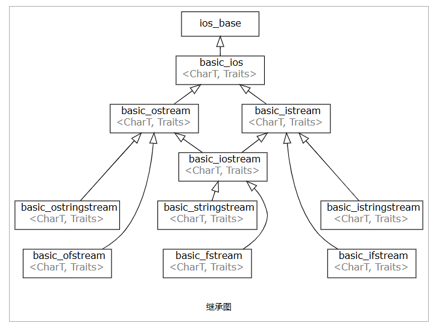

# std::basic_ios



#### std::basic_ios<CharT,Traits>::good()   如果流上最近的 I/O 操作成功完成，则返回 true
#### std::basic_ios<CharT,Traits>::eof()    如果关联的流已到达文件末尾，则返回 true
#### std::basic_ios<CharT,Traits>::fail()   如果关联的流上发生错误，则返回 true
#### std::basic_ios<CharT,Traits>::bad()    如果关联的流上发生了不可恢复的错误，则返回 true
```cpp
bool good() const;
bool eof()  const;
bool fail() const;
bool bad()  const;
```
```cpp
#include <cstdlib>
#include <fstream>
#include <iostream>
 
int main()
{
    std::ifstream file("test.txt");
    if (!file) // operator! is used here
    {  
        std::cout << "File opening failed\n";
        return EXIT_FAILURE;
    }
 
    // typical C++ I/O loop uses the return value of the I/O function
    // as the loop controlling condition, operator bool() is used here
    for (int n; file >> n;)
       std::cout << n << ' ';
    std::cout << '\n';
 
    if (file.bad())
        std::cout << "I/O error while reading\n";
    else if (file.eof())
        std::cout << "End of file reached successfully\n";
    else if (file.fail())
        std::cout << "Non-integer data encountered\n";
}
```


## std::basic_ios<CharT,Traits>::fill
```cpp
 C++ 输入/输出库 std::basic_ios 
CharT fill() const;
CharT fill( CharT ch );
```
管理用于填充输出转换以达到指定字段宽度的填充字符。
1) 返回当前的填充字符。
2) 将填充字符设置为 ch，返回填充字符的先前值。

```cpp
#include <iomanip>
#include <iostream>
 
int main ()
{
    std::cout << "With default setting : [" << std::setw(10) << 40 << "]\n";
    char prev = std::cout.fill('x');
    std::cout << "Replaced '" << prev << "' with '"
              << std::cout.fill() << "': [" << std::setw(10) << 40 << "]\n";
}
```


## std::basic_ios<CharT,Traits>::rdstate
```cpp
iostate rdstate() const;
```
返回当前流错误状态。

返回值
当前流错误状态。它是一个位掩码类型，可以是以下常量的组合

常量	解释
- **goodbit**	无错误
- **badbit**	不可恢复的流错误
- **failbit**	输入/输出操作失败（格式化或提取错误）
- **eofbit**	关联的输入序列已到达文件末尾

```cpp
#include <iostream>
#include <sstream>
 
int main()
{
    std::ostringstream stream;
    if (stream.rdstate() == std::ios_base::goodbit)
        std::cout << "stream state is goodbit\n";
 
    stream.setstate(std::ios_base::eofbit);
 
    // check state is exactly eofbit (no failbit and no badbit)
    if (stream.rdstate() == std::ios_base::eofbit)
        std::cout << "stream state is eofbit\n";
}
```

## std::basic_ios<CharT,Traits>::setstate
```cpp
void setstate( iostate state );
```
设置流错误标志 state，附加到当前已设置的标志。本质上调用 clear(rdstate() | state)。可能抛出异常。
参数
state	-	要设置的流错误状态标志。它可以是以下常量的组合
常量	解释
- **goodbit**	无错误
- **badbit**	不可恢复的流错误
- **failbit**	输入/输出操作失败（格式化或提取错误）
- **eofbit**	关联的输入序列已到达文件末尾
```cpp
#include <iostream>
#include <sstream>
 
int main()
{
    std::ostringstream stream;
 
    if (!stream.fail())
        std::cout << "stream is not fail\n";
 
    stream.setstate(std::ios_base::failbit);
 
    if (stream.fail())
        std::cout << "now stream is fail\n";
 
    if (!stream.good())
        std::cout << "and stream is not good\n";
}
```

## std::basic_ios<CharT,Traits>::clear
通过将流错误状态标志设置为 state 的值来设置它们。默认情况下，赋值为 std::ios_base::goodbit，其效果是清除所有错误状态标志。
```cpp
#include <iostream>
#include <string>
 
int main()
{
    for (char c : {'\n', '4', '1', '.', '3', '\n', 'Z', 'Y', 'X'})
        std::cin.putback(c); // emulate user's input (not portable: see ungetc Notes)
 
    double n;
    while (std::cout << "Please, enter a number: " && !(std::cin >> n))
    {
        std::cin.clear();
        std::string line;
        std::getline(std::cin, line);
        std::cout << line << "\nI am sorry, but '" << line << "' is not a number\n";
    }
    std::cout << n << "\nThank you for entering the number " << n << '\n';
}
```

## std::basic_ios<CharT,Traits>::rdbuf
```cpp
std::basic_streambuf<CharT, Traits>* rdbuf() const;
	
std::basic_streambuf<CharT, Traits>* rdbuf( std::basic_streambuf<CharT, Traits>* sb );
```
1) 返回关联的流缓冲区。如果不存在关联的流缓冲区，则返回空指针。
2) 将关联的流缓冲区设置为 sb。错误状态通过调用 clear() 清除。返回操作之前的关联流缓冲区。如果不存在关联的流缓冲区，则返回空指针。

```cpp
#include <iostream>
#include <sstream>
 
int main()
{
    std::ostringstream local;
    auto cout_buff = std::cout.rdbuf(); // save pointer to std::cout buffer
 
    std::cout.rdbuf(local.rdbuf()); // substitute internal std::cout buffer with
                                    // buffer of 'local' object
 
    // now std::cout work with 'local' buffer
    // you don't see this message
    std::cout << "some message";
 
    // go back to old buffer
    std::cout.rdbuf(cout_buff);
 
    // you will see this message
    std::cout << "back to default buffer\n";
 
    // print 'local' content
    std::cout << "local content: " << local.str() << "\n";
}
```


##### 重定向流的输入/输出目标

临时修改流（如 std::cout）的缓冲区，将输出重定向到文件或字符串流等。
示例：将 std::cout 输出重定向到文件

```cpp
#include <iostream>
#include <fstream>

int main() {
    std::ofstream file("output.txt");
    std::streambuf* old_buf = std::cout.rdbuf(); // 保存原缓冲区
    std::cout.rdbuf(file.rdbuf()); // 重定向到文件

    std::cout << "此内容写入文件"; // 输出到 output.txt

    std::cout.rdbuf(old_buf); // 恢复原缓冲区
    return 0;
}
```
##### 高效流数据传输
直接通过缓冲区操作在流之间传输数据，避免逐字符处理。

示例：将文件内容快速复制到另一个流
```CPP
#include <fstream>
#include <iostream>

int main() {
    std::ifstream src("source.txt");
    std::ofstream dst("destination.txt");
    dst << src.rdbuf(); // 直接复制整个缓冲区内容
    return 0;
}
```


`std::basic_ios<CharT, Traits>::tie` 是 C++ 标准库中用于管理流同步的成员函数。它允许将一个输出流与当前流绑定，以确保在特定操作（如输入/输出请求）发生时自动刷新绑定的输出流。以下是其详细说明：

---

### **功能概述**
- **作用**：  
  `tie` 用于 **获取或设置与当前流绑定的输出流指针**。绑定后，当当前流执行输入/输出操作时，绑定的输出流会自动刷新（即调用 `flush()`）。
- **重载形式**：
  1. **获取绑定的流**：  
     ```cpp
     std::basic_ostream<CharT, Traits>* tie() const;
     ```
     返回当前绑定的输出流指针，若无绑定则返回 `nullptr`。
  2. **设置绑定的流**：  
     ```cpp
     std::basic_ostream<CharT, Traits>* tie(std::basic_ostream<CharT, Traits>* strm);
     ```
     将当前流绑定到 `strm`，返回之前绑定的输出流指针。

---

### **主要用途**
#### 1. **同步流缓冲区**
默认情况下，某些输入流（如 `std::cin`）会绑定到输出流（如 `std::cout`），以确保在输入操作前刷新输出缓冲区。例如：
```cpp
std::cout << "请输入内容："; // 提示信息可能未立即显示（缓冲区未刷新）
int value;
std::cin >> value;           // 读取输入前，自动刷新 std::cout 的缓冲区
```
此时 `std::cin` 的 `tie` 默认指向 `std::cout`，因此在读取输入前，`std::cout` 的缓冲区会被刷新，提示信息会立即显示。

#### 2. **自定义绑定逻辑**
可手动绑定或解绑流，以控制缓冲区的刷新行为：
```cpp
// 解绑 cin 和 cout
std::ostream* old_tie = std::cin.tie(nullptr);
// 此时 cin 的输入操作不会触发 cout 的刷新

// 恢复原绑定
std::cin.tie(old_tie);
```

#### 3. **性能优化**
减少不必要的自动刷新以提高效率。例如，若无需实时输出日志，可解绑流：
```cpp
std::ofstream log_file("log.txt");
std::cout.tie(&log_file); // 绑定 cout 到日志文件（不常见，仅为示例）

// 更常见的场景：解绑默认绑定
std::cin.tie(nullptr); // 禁用 cin 触发 cout 的自动刷新
```

---

### **示例代码**
#### 示例 1：查看默认绑定
```cpp
#include <iostream>

int main() {
    // 查看 cin 默认绑定的流
    std::ostream* tied_stream = std::cin.tie();
    if (tied_stream == &std::cout) {
        std::cout << "cin 默认绑定到 cout\n";
    } else {
        std::cout << "cin 未绑定或绑定到其他流\n";
    }
    return 0;
}
```

#### 示例 2：修改绑定并测试效果
```cpp
#include <iostream>
#include <fstream>

int main() {
    std::ofstream log("log.txt");
    // 将 cout 绑定到日志文件
    std::ostream* old_tie = std::cout.tie(&log);

    std::cout << "此内容写入 log.txt"; 
    // 由于未显式刷新，内容可能仍在缓冲区

    int x;
    std::cout << "请输入一个数字："; // 默认情况下，cin 会触发 cout 刷新
    std::cin >> x;                  // 但此处 cout 已绑定到 log，cin 的 tie 未改变

    // 恢复原绑定
    std::cout.tie(old_tie);
    return 0;
}
```