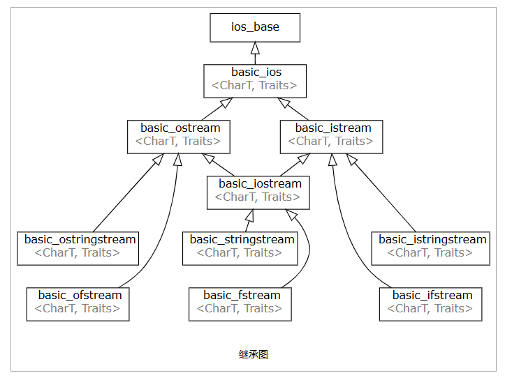

# basic_istream


#### std::cin, std::wcin
```cpp
extern std::istream cin;
extern std::wistream wcin;
```
全局对象 std::cin 和 std::wcin 控制来自实现定义的类型（从 std::streambuf 派生）的流缓冲区的输入，该缓冲区与标准 C 输入流 stdin 关联。

#### std::basic_istream<CharT,Traits>::get
```cpp
int_type get();
basic_istream& get( char_type& ch );
basic_istream& get( char_type* s, std::streamsize count );
basic_istream& get( char_type* s, std::streamsize count, char_type delim );
basic_istream& get( basic_streambuf& strbuf );
basic_istream& get( basic_streambuf& strbuf, char_type delim );
```
**从流中提取字符或多个字符**
- ch	 -	写入结果字符的引用
- s	     -	指向用于存储字符的字符串的指针
- count  -	s 指向的字符串的大小
- delim	 -	用于停止提取的分隔符字符。它不会被提取也不会被存储
- strbuf -	用于读取内容的流缓冲区

```cpp
#include <iostream>
#include <sstream>
 
int main()
{
    std::istringstream s1("Hello, world.");
    char c1 = s1.get(); // reads 'H'
    std::cout << "after reading " << c1 << ", gcount() == " <<  s1.gcount() << '\n';
 
    char c2;
    s1.get(c2);         // reads 'e'
    char str[5];
    s1.get(str, 5);     // reads "llo,"
    std::cout << "after reading " << str << ", gcount() == " <<  s1.gcount() << '\n';
 
    std::cout << c1 << c2 << str;
    s1.get(*std::cout.rdbuf()); // reads the rest, not including '\n'
    std::cout << "\nAfter the last get(), gcount() == " << s1.gcount() << '\n';
}
```


#### std::basic_istream<CharT,Traits>::unget
使最近提取的字符再次可用。

```cpp
#include <iostream>
#include <sstream>
 
int main()
{
    std::istringstream s1("Hello, world.");
    char c1 = s1.get();
    if (s1.unget())
    {
        char c2 = s1.get();
        std::cout << "Got: '" << c1 << "'. Got again: '" << c2 << "'.\n";
    }
}
```


#### std::basic_istream<CharT,Traits>::putback
```cpp
basic_istream& putback( char_type ch );
```
**将字符 ch 放回输入流，以便下一个提取的字符将是 ch。** 也就是说符号必须相同。
```cpp
#include <iostream>
#include <sstream>
 
int main()
{
    std::stringstream s1("Hello, world"); // IO stream
    s1.get();
    if (s1.putback('Y')) // modifies the buffer
        std::cout << s1.rdbuf() << '\n';
    else
        std::cout << "putback failed\n";
 
    std::cout << "--\n";
 
    std::istringstream s2("Hello, world"); // input-only stream
    s2.get();
    if (s2.putback('Y')) // cannot modify input-only buffer
        std::cout << s2.rdbuf() << '\n';
    else
        std::cout << "putback failed\n"; 
    s2.clear();
 
    std::cout << "--\n";
 
    if (s2.putback('H')) // non-modifying putback
        std::cout << s2.rdbuf() << '\n';
    else
        std::cout << "putback failed\n";
}
```


#### std::basic_istream<CharT,Traits>::peek
int_type peek();
**在构造和测试哨兵对象之后，从输入流读取下一个字符，但不提取它。**
```cpp
#include <iostream>
#include <sstream>
 
int main()
{
    std::istringstream s1("Hello, world.");
    char c1 = s1.peek();
    char c2 = s1.get();
    std::cout << "Peeked: " << c1 << " got: " << c2 << '\n';
}
```

#### std::basic_istream<CharT,Traits>::getline
```cpp
basic_istream& getline( char_type* s, std::streamsize count );

basic_istream& getline( char_type* s, std::streamsize count, char_type delim );
```
从流中提取字符，直到行尾或指定的定界符 delim。
```cpp
#include <array>
#include <iostream>
#include <sstream>
#include <vector>
 
int main()
{
    std::istringstream input("abc|def|gh");
    std::vector<std::array<char, 4>> v;
 
    // note: the following loop terminates when std::ios_base::operator bool()
    // on the stream returned from getline() returns false
    for (std::array<char, 4> a; input.getline(&a[0], 4, '|');)
        v.push_back(a);
 
    for (auto& a : v)
        std::cout << &a[0] << '\n';
}
```

#### std::basic_istream<CharT,Traits>::read
```cpp
basic_istream& read( char_type* s, std::streamsize count );
```
从流中提取字符。

s	-	指向字符数组的指针，用于存储要读取的字符
count	-	要读取的字符数
```cpp
#include <cstdint>
#include <fstream>
#include <iostream>
#include <sstream>
#include <string>
 
int main()
{
    // read() is often used for binary I/O
    std::string bin = {'\x12', '\x12', '\x12', '\x12'};
    std::istringstream raw(bin);
    std::uint32_t n;
    if (raw.read(reinterpret_cast<char*>(&n), sizeof n))
        std::cout << std::hex << std::showbase << n << '\n';
 
    // prepare file for next snippet
    std::ofstream("test.txt", std::ios::binary) << "abcd1\nabcd2\nabcd3";
 
    // read entire file into string
    if (std::ifstream is{"test.txt", std::ios::binary | std::ios::ate})
    {
        auto size = is.tellg();
        std::string str(size, '\0'); // construct string to stream size
        is.seekg(0);
        if (is.read(&str[0], size))
            std::cout << str << '\n';
    }
}
```

#### std::basic_istream<CharT,Traits>::readsome
```cpp
std::streamsize readsome( char_type* s, std::streamsize count );
```
从输入流中提取最多 count 个立即可用的字符。 提取的字符存储到 s 指向的字符数组中。
参数
s	-	指向用于存储字符的字符数组的指针
count	-	要读取的最大字符数

#### std::basic_istream<CharT,Traits>::gcount
```cpp
std::streamsize gcount() const;
```
返回上一次非格式化输入操作提取的字符数，如果该数字无法表示，则返回 std::streamsize 的最大可表示值。


#### std::basic_istream<CharT,Traits>::ignore
```cpp
basic_istream& ignore( std::streamsize count = 1, int_type delim = Traits::eof() );
```
**从输入流中提取并丢弃字符，直到遇到定界符 delim（包括定界符）。**
参数：
count：要跳过的最大字符数（默认为 1）。
delim：分隔符，遇到此字符时停止跳过（默认为 Traits::eof()，即文件结束符）。

##### 清除输入缓冲区残留字符
当混合使用 operator>> 和 getline 时，输入缓冲区可能残留换行符（\n），导致后续 getline 直接读取空字符串。
```cpp
int age;
std::string name;

std::cout << "输入年龄：";
std::cin >> age;            // 输入后缓冲区残留换行符 '\n'

// 清除换行符
std::cin.ignore(std::numeric_limits<std::streamsize>::max(), '\n');

std::cout << "输入姓名：";
std::getline(std::cin, name); // 正常读取
```

###### 跳过无效输入
当输入格式不符合预期时（如输入非数字字符到 int 变量），需清除错误状态并清空缓冲区。
示例：
```cpp
int value;
while (true) {
    std::cout << "输入一个整数：";
    if (std::cin >> value) {
        break; // 输入有效
    } else {
        std::cin.clear(); // 清除错误状态
        std::cin.ignore(std::numeric_limits<std::streamsize>::max(), '\n'); // 清空缓冲区
        std::cout << "输入无效，请重试！\n";
    }
}
```


###### 快速跳过整行输入
直接跳过当前行的所有剩余字符（直到换行符）。
示例：
```CPP
std::cin.ignore(std::numeric_limits<std::streamsize>::max(), '\n'); // 跳过整行
```

###### 限制跳过的字符数
仅跳过固定数量的字符（不依赖分隔符）。
示例：

```CPP
// 输入 "ABCDEFGHI"
std::cin.ignore(5); // 跳过前5个字符（"ABCDE"）
char c;
std::cin >> c;      // c = 'F'
```


`std::basic_istream<CharT, Traits>::gcount` 是 C++ 标准库中用于获取最后一次非格式化输入操作所读取字符数的成员函数。它在处理不确定长度的输入或需要精确控制输入流时非常有用。以下是其详细说明：

---

### **函数原型**
```cpp
std::streamsize gcount() const;
```
- **返回值**：返回最后一次非格式化输入操作实际读取的字符数（类型为 `std::streamsize`）。
- **作用域**：仅在最后一次非格式化输入操作后调用有效，后续其他操作（包括格式化输入）会重置返回值。

---

### **核心用途**

#### 1. **检查非格式化输入的实际读取量**
   - 适用于 `get()`, `getline()`, `read()`, `ignore()` 等非格式化输入操作。
   - **示例**：使用 `read` 读取二进制数据块，通过 `gcount` 确认实际读取的字节数。
     ```cpp
     char buffer[1024];
     std::ifstream file("data.bin", std::ios::binary);
     file.read(buffer, sizeof(buffer));
     std::streamsize bytes_read = file.gcount();
     if (bytes_read > 0) {
         process_data(buffer, bytes_read);
     }
     ```

#### 2. **验证输入是否完整**
   - 当期望读取固定数量的字符时，通过 `gcount` 判断是否成功读取。
   - **示例**：检查 `getline` 是否完整读取一行。
     ```cpp
     char line[256];
     std::cin.getline(line, sizeof(line));
     if (std::cin.gcount() == sizeof(line)-1) {
         // 缓冲区已满，可能还有剩余字符未读取
         std::cin.clear(); // 清除可能的失败状态（若输入过长）
         std::cin.ignore(std::numeric_limits<std::streamsize>::max(), '\n');
     }
     ```

#### 3. **处理流结束或错误**
   - 结合 `eof()` 或 `fail()` 判断输入终止原因。
   - **示例**：读取到文件末尾时，获取实际读取的字符数。
     ```cpp
     char buffer[100];
     std::ifstream file("text.txt");
     file.read(buffer, 100);
     if (file.eof()) {
         std::cout << "读取到文件末尾，实际读取字符数：" << file.gcount();
     }
     ```

---

### **注意事项**

1. **仅适用于非格式化输入**  
   - `gcount` 对格式化输入（如 `operator>>`）无效，此时返回 `0`。
   - **错误示例**：
     ```cpp
     int num;
     std::cin >> num;       // 格式化输入
     std::cout << std::cin.gcount(); // 输出 0
     ```

2. **时效性**  
   - `gcount` 的值在调用其他输入操作后会被重置。
   - **正确用法**：
     ```cpp
     char c;
     std::cin.get(c);        // 非格式化输入
     std::streamsize n = std::cin.gcount(); // n = 1（若成功）
     ```

### **对比其他方法**
| 方法                | 作用                           | 适用场景                     |
|---------------------|-------------------------------|----------------------------|
| `gcount()`          | 返回最后一次非格式化输入读取的字符数 | 检查实际读取量、处理不完整输入 |
| `tellg()`           | 返回流的当前读取位置           | 定位流位置、随机访问         |
| `eof()` / `fail()`  | 检查流状态                     | 判断输入终止原因             |

---

### **示例代码**

#### 示例 1：读取文件并统计实际字节数
```cpp
#include <fstream>
#include <iostream>

int main() {
    std::ifstream file("example.txt", std::ios::binary);
    if (!file) {
        std::cerr << "文件打开失败\n";
        return 1;
    }

    char buffer[1024];
    file.read(buffer, sizeof(buffer));
    std::streamsize bytes = file.gcount();

    if (bytes > 0) {
        std::cout << "读取了 " << bytes << " 字节\n";
    } else if (file.eof()) {
        std::cout << "文件为空\n";
    } else {
        std::cerr << "读取错误\n";
    }

    return 0;
}
```

#### 示例 2：处理用户输入过长的情况
```cpp
#include <iostream>
#include <limits>

int main() {
    char input[10];
    std::cout << "输入最多9个字符：";
    std::cin.get(input, sizeof(input));

    if (std::cin.gcount() == sizeof(input)-1) {
        // 输入过长，清除残留字符
        std::cin.clear();
        std::cin.ignore(std::numeric_limits<std::streamsize>::max(), '\n');
        std::cout << "输入过长，已截断\n";
    } else {
        std::cout << "输入有效\n";
    }

    return 0;
}
```
