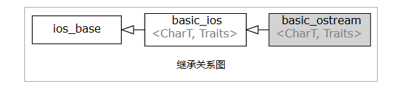

## std::cout, std::wcout
## std::cerr, std::wcerr
## std::clog, std::wclog


## std::basic_ostream<CharT,Traits>::write

```cpp
basic_ostream& write( const char_type* s, std::streamsize count );
```
行为如同一个未格式化输出函数。在构造并检查哨兵对象之后，从字符数组的连续位置输出字符，该字符数组的第一个元素由 s 指向。
```cpp
#include <iostream>
 
int main()
{
    int n = 0x41424344;
    std::cout.write(reinterpret_cast<char*>(&n), sizeof n) << '\n';
 
    char c[] = "This is sample text.";
    std::cout.write(c, 4).write("!\n", 2);
}
```


## std::basic_ostream<CharT,Traits>::put
```cpp
basic_ostream& put( char_type ch );
```
行为类似于 UnformattedOutputFunction。 在构造并检查 sentry 对象后，将字符 ch 写入输出流。
```cpp
    std::cout.put('a'); // normal usage
    std::cout.put('\n');
 
    std::ofstream s("/does/not/exist/");
    s.clear(); // pretend the stream is good
    std::cout << "Unformatted output: ";
    s.put('c'); // this will set badbit, but not failbit
```


## std::basic_ostream<CharT,Traits>::tellp
```cpp
pos_type tellp();
```
返回当前关联的 streambuf 对象的输出位置指示器。
```cpp
#include <iostream>
#include <sstream>
int main()
{
    std::ostringstream s;
    std::cout << s.tellp() << '\n';
    s << 'h';
    std::cout << s.tellp() << '\n';
    s << "ello, world ";
    std::cout << s.tellp() << '\n';
    s << 3.14 << '\n';
    std::cout << s.tellp() << '\n' << s.str();
}
```

## std::basic_ostream<CharT,Traits>::seekp
```cpp
basic_ostream& seekp( pos_type pos );

basic_ostream& seekp( off_type off, std::ios_base::seekdir dir );
```
**设置当前关联的 streambuf 对象的输出位置指示器。**
#### 参数
- pos	-	要将输出位置指示器设置到的绝对位置
- off	-	要将输出位置指示器设置到的相对位置（正或负）
- dir	-	定义应用相对偏移量的基准位置。它可以是以下常量之一
常量	解释
  - beg  流的开始
  - end	 流的结尾
  - cur	 流位置指示器的当前位置

```cpp
#include <iostream>
#include <sstream>
 
int main()
{
    std::ostringstream os("hello, world");
    os.seekp(7);
    os << 'W';
    os.seekp(0, std::ios_base::end);
    os << '!';
    os.seekp(0);
    os << 'H';
    std::cout << os.str() << '\n';
}
```


