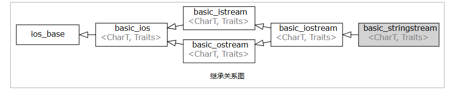

# std::basic_stringstream


类模板 std::basic_stringstream 实现了基于字符串流的输入和输出操作。
它实际上存储了 std::basic_string 的一个实例，并在其上执行输入和输出操作。


## 重要函数

### str

```cpp
#include <iostream>
#include <sstream>
 
int main()
{
    int n;
 
    std::istringstream in; // could also use in("1 2")
    in.str("1 2");
    in >> n;
    std::cout << "After reading the first int from \"1 2\", the int is "
              << n << ", str() = \"" << in.str() << "\"\n";
 
    std::ostringstream out("1 2");
    out << 3;
    std::cout << "After writing the int '3' to output stream \"1 2\""
              << ", str() = \"" << out.str() << "\"\n";
 
    std::ostringstream ate("1 2", std::ios_base::ate);
    ate << 3;
    std::cout << "After writing the int '3' to append stream \"1 2\""
              << ", str() = \"" << ate.str() << "\"\n";
}
```

### rdbuf
```cpp
std::basic_istringstream::rdbuf

std::basic_stringbuf<CharT, Traits, Allocator>* rdbuf() const;

```

在 C++ 标准库中，`std::istringstream`、`std::ostringstream` 和 `std::stringstream` 是用于字符串流操作的类，
定义在 `<sstream>` 头文件中。它们将字符串与流操作结合，提供了类型安全、灵活且高效的字符串处理方式。以下是它们的详细说明：

---

### **1. `std::istringstream`：字符串输入流**
#### **用途**
- **从字符串中提取数据**：将字符串作为输入源，按需解析为基本数据类型（如 `int`、`double`、`string` 等）。
- **格式化解析**：支持类似 `std::cin` 的操作符（`>>`），按空格或指定分隔符分割数据。

#### **设计目的**
- 提供一种**安全的字符串解析机制**，避免手动处理字符串分割和类型转换。
- 替代 C 风格的 `sscanf`，解决其类型不安全、缓冲区溢出等问题。

#### **示例**
```cpp
#include <sstream>
#include <string>

std::string data = "42 3.14 hello";
std::istringstream iss(data);

int num;
double pi;
std::string text;

iss >> num >> pi >> text; // num=42, pi=3.14, text="hello"
```

#### **好处**
- **类型安全**：自动处理类型转换，避免非法数据导致的错误。
- **灵活性**：支持流操作符重载，可扩展用于自定义类型。
- **错误处理**：通过流状态（`fail()`、`eof()`）检测解析错误。

---

### **2. `std::ostringstream`：字符串输出流**
#### **用途**
- **将数据格式化为字符串**：将不同类型的数据拼接为字符串，支持自动类型转换。
- **高效构建字符串**：替代手动使用 `+` 或 `sprintf` 拼接字符串的方式。

#### **设计目的**
- 提供一种**类型安全的字符串构建方式**，避免 `sprintf` 的缓冲区溢出风险。
- 支持链式操作和复杂格式化（如设置精度、填充字符等）。

#### **示例**
```cpp
#include <sstream>
#include <string>

std::ostringstream oss;
int age = 25;
double height = 1.75;

oss << "年龄：" << age << "，身高：" << height << "米";
std::string result = oss.str(); // "年龄：25，身高：1.75米"
```

#### **好处**
- **内存安全**：自动管理缓冲区，无需预分配固定大小。
- **格式化控制**：支持 `std::setprecision`、`std::hex` 等格式化操作。
- **可读性**：代码简洁，逻辑清晰。

---

### **3. `std::stringstream`：字符串双向流**
#### **用途**
- **同时支持输入和输出**：可在同一个流中读取和写入字符串。
- **动态修改字符串内容**：适用于需要多次读写操作的复杂场景。

#### **设计目的**
- 结合 `istringstream` 和 `ostringstream` 的功能，提供**全双工字符串流操作**。
- 适用于需要动态构建和解析字符串的场景。

#### **示例**
```cpp
#include <sstream>
#include <string>

std::stringstream ss;
ss << "Value: " << 100;      // 写入数据
int value;
ss >> value;                 // 尝试读取整数（失败，因流中有非数字内容）

ss.str("");                  // 清空流内容
ss << "500";
ss >> value;                 // 成功读取 value=500
```

#### **好处**
- **灵活性**：支持混合输入输出操作，适合动态数据处理。
- **状态管理**：可通过 `clear()` 重置流状态，重用同一流对象。

---

### **三者的对比**
| 类名               | 功能           | 典型场景                         |
|--------------------|---------------|----------------------------------|
| `std::istringstream` | 仅输入        | 解析字符串中的数据（如配置文件） |
| `std::ostringstream` | 仅输出        | 构建复杂格式的字符串（如日志）   |
| `std::stringstream`  | 输入 + 输出   | 动态修改字符串或复杂数据处理     |

---

### **设计目标与优势总结**
#### **设计目标**
- **统一流接口**：与文件流（`fstream`）、标准输入输出流（`cin`/`cout`）共享相同的操作接口，降低学习成本。
- **类型安全**：利用 C++ 类型系统，避免 C 风格字符串处理的常见错误。
- **内存安全**：自动管理字符串缓冲区，防止溢出。

#### **核心优势**
1. **代码简洁性**  
   通过流操作符（`<<` 和 `>>`）简化字符串的构建和解析，避免繁琐的拼接或分割代码。

2. **格式化能力**  
   支持丰富的格式化选项（如精度、进制、对齐），无需手动处理细节。

3. **可扩展性**  
   可通过重载 `operator<<` 和 `operator>>` 支持自定义类型的序列化与反序列化。

4. **错误恢复**  
   通过流状态检查（如 `fail()`、`eof()`）和 `clear()` 方法，实现健壮的错误处理。

---

### **实际应用场景**
1. **配置文件解析**  
   使用 `istringstream` 从字符串中提取键值对。

2. **日志系统**  
   使用 `ostringstream` 动态构建日志条目，确保线程安全和格式统一。

3. **数据转换**  
   利用 `stringstream` 将数值转换为字符串，或反之。

4. **协议处理**  
   在网络通信中，序列化/反序列化数据包。

---

### **与 C 风格函数的对比**
| 特性                | C++ 字符串流               | C 风格函数（`sprintf`/`sscanf`） |
|---------------------|---------------------------|----------------------------------|
| 类型安全            | ✔️ 编译时检查类型          | ❌ 依赖格式字符串，易出错         |
| 内存安全            | ✔️ 自动管理缓冲区          | ❌ 需手动预分配，易溢出           |
| 格式化灵活性        | ✔️ 支持链式操作和复杂格式  | ✔️ 灵活但语法复杂                |
| 自定义类型支持      | ✔️ 通过重载操作符          | ❌ 仅支持基本类型                 |
| 错误处理            | ✔️ 流状态机制              | ❌ 需手动检查返回值               |

---

### **总结**
- **`std::istringstream`**：专注于从字符串中提取数据，适合解析场景。
- **`std::ostringstream`**：专注于构建字符串，适合格式化输出。
- **`std::stringstream`**：双向操作，适合动态读写需求。

它们的设计旨在提供一种**安全、灵活且高效**的字符串处理方式，替代传统的 C 风格函数，同时与 C++ 流生态系统无缝集成。通过合理使用这些类，可以显著提升代码的可读性、可维护性和健壮性。