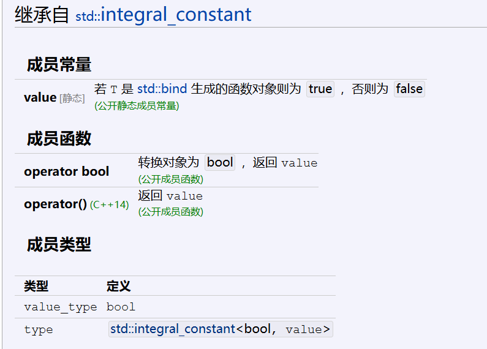
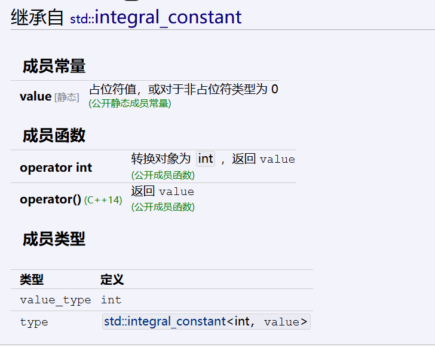

<!-- @import "[TOC]" {cmd="toc" depthFrom=1 depthTo=6 orderedList=false} -->
<!-- code_chunk_output -->

- [std::function](#stdfunction)
- [std::bind](#stdbind)
      - [std::is_bind_expression](#stdis_bind_expression)
        - [成员常量](#成员常量)
        - [帮助变量模板](#帮助变量模板)
      - [std::is_placeholder](#stdis_placeholder)
- [std::mem_fn](#stdmem_fn)

<!-- /code_chunk_output -->

# std::function
```cpp
template< class R, class... Args >
class function<R(Args...)>;
```
类模板 std::function 是通用多态函数封装器。
std::function 的实例能存储、复制及调用任何可调用 (Callable) 
目标——函数、 lambda 表达式、 bind 表达式或其他函数对象，还有指向成员函数指针和指向数据成员指针。

```cpp{.line-numbers}
#include <iostream>
#include <functional>

int main() {
    // 存储 Lambda
    std::function<int(int, int)> func = [](int a, int b) { return a + b; };
    std::cout << func(2, 3) << std::endl; // 输出 5

    // 存储成员函数
    struct Calculator {
        int multiply(int a, int b) { return a * b; }
    };
    Calculator calc;
    std::function<int(Calculator&, int, int)> member_func = &Calculator::multiply;
    std::cout << member_func(calc, 4, 5) << std::endl; // 输出 20

    // 存储成员变量（需通过对象访问）
    struct Point { int x; int y; };
    Point p{10, 20};
    std::function<int(Point&)> get_x = &Point::x;
    std::cout << get_x(p) << std::endl; // 输出 10
}

```


```cpp{.line-numbers}
#include <functional>
#include <iostream>

struct Foo {
    Foo(int num) : num_(num) {}
    void print_add(int i) const { std::cout << num_+i << '\n'; }
    int num_;
};

void print_num(int i)
{
    std::cout << i << '\n';
}

struct PrintNum {
    void operator()(int i) const
    {
        std::cout << i << '\n';
    }
};

int main()
{
    // 存储自由函数
    std::function<void(int)> f_display = print_num;
    f_display(-9);

    // 存储 lambda
    std::function<void()> f_display_42 = []() { print_num(42); };
    f_display_42();

    // 存储到 std::bind 调用的结果
    std::function<void()> f_display_31337 = std::bind(print_num, 31337);
    f_display_31337();

    // 存储到成员函数的调用
    std::function<void(const Foo&, int)> f_add_display = &Foo::print_add;
    const Foo foo(314159);
    f_add_display(foo, 1);
    f_add_display(314159, 1);

    // 存储到数据成员访问器的调用
    std::function<int(const Foo &)> f_num = &Foo::num_;
    std::cout << "num_: " << f_num(foo) << '\n';

    // 存储到成员函数及对象的调用
    using std::placeholders::_1;
    std::function<void(int)> f_add_display2 = std::bind( &Foo::print_add, foo, _1 );
    f_add_display2(2);

    // 存储到成员函数和对象指针的调用
    std::function<void(int)> f_add_display3 = std::bind( &Foo::print_add, &foo, _1 );
    f_add_display3(3);

    // 存储到函数对象的调用
    std::function<void(int)> f_display_obj = PrintNum();
    f_display_obj(18);
}
```

# std::bind
```cpp
 template< class R, class F, class... Args >
   /_unspecified_/ bind( F&& f, Args&&... args );
   函数模板 bind 生成 f 的转发调用包装器。调用此包装器等价于以一些绑定到 args 的参数调用 f 。
```
std::bind 是 C++11 引入的函数适配器，用于将可调用对象（函数、成员函数、函数对象等）与部分参数绑定，生成一个新的可调用对象。它支持参数的部分绑定、顺序调整和值/引用传递控制，常用于延迟调用或参数适配。

#### 占位符（Placeholders）
占位符定义在命名空间 std::placeholders 中，表示调用时提供的参数位置：

**_1：对应调用时的第一个参数。**
**_2：对应调用时的第二个参数，依此类推。**


### 绑定成员变量
直接访问成员变量（返回引用）：
```cpp
auto bind_x = std::bind(&Point::x, &p);
std::cout << bind_x(); // 输出 p.x 的值
```

```cpp
#include <random>
#include <iostream>
#include <memory>
#include <functional>

void f(int n1, int n2, int n3, const int& n4, int n5)
{
    std::cout << n1 << ' ' << n2 << ' ' << n3 << ' ' << n4 << ' ' << n5 << '\n';
}

int g(int n1)
{
    return n1;
}

struct Foo {
    void print_sum(int n1, int n2)
    {
        std::cout << n1+n2 << '\n';
    }
    int data = 10;
};

int main()
{
    using namespace std::placeholders;  // 对于 _1, _2, _3...

    // 演示参数重排序和按引用传递
    int n = 7;
    // （ _1 与 _2 来自 std::placeholders ，并表示将来会传递给 f1 的参数）
    auto f1 = std::bind(f, _2, 42, _1, std::cref(n), n);
    n = 10;
    f1(1, 2, 1001); // 1 为 _1 所绑定， 2 为 _2 所绑定，不使用 1001
                    // 进行到 f(2, 42, 1, n, 7) 的调用

    // 嵌套 bind 子表达式共享占位符
    auto f2 = std::bind(f, _3, std::bind(g, _3), _3, 4, 5);
    f2(10, 11, 12); // 进行到 f(12, g(12), 12, 4, 5); 的调用

    // 常见使用情况：以分布绑定 RNG
    std::default_random_engine e;
    std::uniform_int_distribution<> d(0, 10);
    std::function<int()> rnd = std::bind(d, e); // e 的一个副本存储于 rnd
    for(int n=0; n<10; ++n)
        std::cout << rnd() << ' ';
    std::cout << '\n';

    // 绑定指向成员函数指针
    Foo foo;
    auto f3 = std::bind(&Foo::print_sum, &foo, 95, _1);
    f3(5);

    // 绑定指向数据成员指针
    auto f4 = std::bind(&Foo::data, _1);
    std::cout << f4(foo) << '\n';

    // 智能指针亦能用于调用被引用对象的成员
    std::cout << f4(std::make_shared<Foo>(foo)) << '\n'
              << f4(std::make_unique<Foo>(foo)) << '\n';
}
```

#### std::is_bind_expression

若 T 是调用 std::bind 产生的类型，则此模板从 std::true_type 导出。对于任何其他类型，此模板从 std::false_type 导出。

##### 成员常量



##### 帮助变量模板

template< class T >
inline constexpr bool is_bind_expression_v = is_bind_expression<T>::value

```cpp
int main() {
    // 假设我们有一个 std::bind 表达式
    auto bound_func = std::bind([](int x, int y) { return x + y; }, 2, 3);
    // 检查是否是 std::bind 表达式的结果
    if constexpr (std::is_bind_expression_v<decltype(bound_func)>) {
        std::cout << "是 std::bind 表达式的结果" << std::endl;
    } else {
        // 不是 std::bind 表达式的结果
    }
    return 0;
}
```

#### std::is_placeholder



```cpp
 std::cout << "Standard placeholder _5 is for the argument number "
              << std::is_placeholder<decltype(std::placeholders::_5)>::value
              << '\n';
```

# std::mem_fn

函数模板 std::mem_fn 生成指向成员指针的包装对象，它可以存储、复制及调用指向成员指针。到对象的引用和指针（含智能指针）可在调用 std::mem_fn 时使用。
std::mem_fn 是 C++ 标准库中的一个函数模板，它用于创建一个指向成员函数的指针，这样可以将成员函数作为参数传递给算法或者其他函数。
这在需要将成员函数作为回调或者需要存储成员函数指针时非常有用。


std::mem_fn 是 C++ 标准库 <functional> 头文件中提供的一个工具函数，用于将类的成员函数或成员变量包装成一个可调用对象（函数对象）。
它使得非静态成员可以像普通函数一样被调用，尤其在需要将成员函数传递给算法（如 for_each、transform）或与标准库组件（如 bind、thread）配合使用时非常有用。

核心功能
将成员函数转换为可调用对象
允许将类的成员函数包装成独立函数对象，调用时需传入对象实例（或指针、引用）。

支持成员变量
也可以包装成员变量，调用时返回该成员的引用，支持读写操作

#include <functional>
auto mem_fn_wrapper = std::mem_fn(PM pm);
PM 是成员指针类型（如 ReturnType (Class::*)(Args...) 或 DataType Class::*）。
pm 是成员函数或成员变量的指针（如 &ClassName::member）。


#### std::mem_fn 生成的包装器支持多种对象传递形式：
`std::mem_fn` 是 C++ 标准库 `<functional>` 头文件中提供的一个工具函数，用于将类的**成员函数**或**成员变量**包装成一个可调用对象（函数对象）。
它使得非静态成员可以像普通函数一样被调用，尤其在需要将成员函数传递给算法（如 `for_each`、`transform`）或与标准库组件（如 `bind`、`thread`）配合使用时非常有用。

---

### **核心功能**
1. **将成员函数转换为可调用对象**  
   允许将类的成员函数包装成独立函数对象，调用时需传入对象实例（或指针、引用）。
   
2. **支持成员变量**  
   也可以包装成员变量，调用时返回该成员的引用，支持读写操作。

### **基本用法**
#### 语法
```cpp
#include <functional>
auto mem_fn_wrapper = std::mem_fn(PM pm);
```
- `PM` 是成员指针类型（如 `ReturnType (Class::*)(Args...)` 或 `DataType Class::*`）。
- `pm` 是成员函数或成员变量的指针（如 `&ClassName::member`）。

---

### **示例场景**
#### 1. 包装成员函数
```cpp
class Test {
public:
    void print() const { std::cout << "Hello" << std::endl; }
    int add(int x) { return value + x; }
    int value = 10;
};

// 包装成员函数
auto print_fn = std::mem_fn(&Test::print);
auto add_fn   = std::mem_fn(&Test::add);

Test obj;
print_fn(obj);      // 输出 "Hello"
int result = add_fn(obj, 5); // 调用 obj.add(5), result = 15
```

#### 2. 包装成员变量
```cpp
auto value_fn = std::mem_fn(&Test::value);
Test obj;
value_fn(obj) = 20;           // 修改 obj.value = 20
std::cout << value_fn(obj);   // 输出 20
```

#### 3. 与 STL 算法结合
```cpp
std::vector<Test> objects = {Test(), Test(), Test()};

// 对所有对象调用 print()
std::for_each(objects.begin(), objects.end(), std::mem_fn(&Test::print));

// 提取所有对象的 value 成员
std::vector<int> values;
std::transform(objects.begin(), objects.end(), std::back_inserter(values),
               std::mem_fn(&Test::value)); // values = [20, 20, 20]
```

---

### **调用方式**
`std::mem_fn` 生成的包装器支持多种对象传递形式：
- **对象实例**：`fn(obj, args...)`
- **对象指针**：`fn(&obj, args...)`
- **引用包装器**：`fn(std::ref(obj), args...)`
- **智能指针**：`fn(std::make_shared<Test>(), args...)`

```cpp
Test obj;
auto fn = std::mem_fn(&Test::print);

fn(obj);           // 直接传递对象
fn(&obj);          // 传递指针
fn(std::ref(obj)); // 传递引用包装器
```

---

### **对比其他工具**
1. **`std::bind`**  
   `bind` 需要显式绑定对象实例，而 `mem_fn` 延迟对象传递，更灵活：
   ```cpp
   // 使用 bind（需提前绑定对象）
   auto bind_fn = std::bind(&Test::print, &obj);
   bind_fn();  // 调用 obj.print()

   // 使用 mem_fn（调用时传递对象）
   auto mem_fn = std::mem_fn(&Test::print);
   mem_fn(obj); // 调用 obj.print()
   ```

2. **Lambda 表达式**  
   Lambda 更灵活但代码略长，`mem_fn` 更简洁：
   ```cpp
   // Lambda 方式
   std::for_each(objects.begin(), objects.end(), [](const auto& obj) { obj.print(); });

   // mem_fn 方式
   std::for_each(objects.begin(), objects.end(), std::mem_fn(&Test::print));
   ```

---

### **注意事项**
1. **成员指针语法**  
   必须用 `&ClassName::Member` 获取成员指针，且成员必须为非静态。

2. **参数匹配**  
   成员函数的参数需与调用时传递的参数一致。例如：
   ```cpp
   // 成员函数：int add(int x)
   add_fn(obj, 5); // 正确
   add_fn(obj);    // 错误：缺少参数
   ```

3. **兼容性**  
   `std::mem_fn` 自 C++11 起支持，需编译器兼容。

