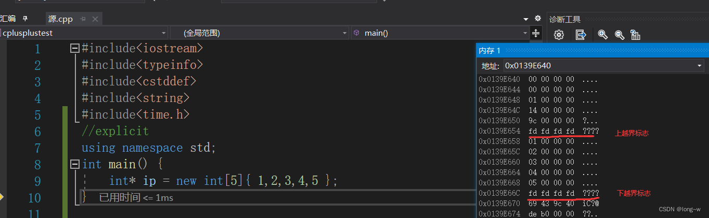
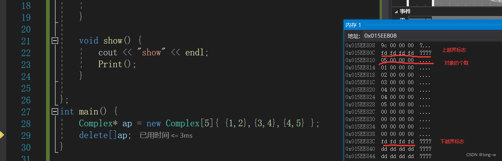
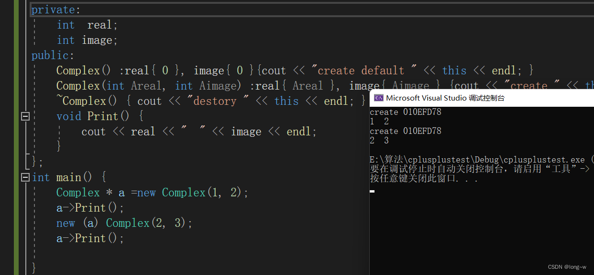

## 内存空间申请

- malloc：函数原型void* malloc(size_t size) 参数size为要分配的字节数，返回值是void*,通常要强转为我们需要申请空间的类型,开辟成功回返回空间首地址，失败会返回NULL，但是申请成功后并不进行初始化，每个数据都是随机值。

- calloc：函数原型void* calloc(size_t number, size_t size); 参数number为要申请的个数；size为每一个数据的大小，返回值是void*,通常要强转为我们需要申请空间的类型,开辟成功回返回空间首地址，失败会返回NULL，但是申请成功会对空间进行初始化，且初始为0。

- realloc：函数原型 void* realloc(void * mem_address, unsigned int newsize); 参数address为要扩展调整的空间首地址，参数newsize为调整为多少字节的空间，返回值是void*,通常要强转为我们需要申请空间的类型,开辟成功回返回空间首地址，失败会返回NULL，但是申请成功后并不进行初始化，每个数据都是随机值。注意的是，之前申请过的空间再用realloc来扩展的话不用释放，只要释放扩展后的空间即可


## new的用法
1. new T( ) 分配这种类型的一个大小的内存空间,并以括号中的值来初始化这个变量;
2. new T[ ] 分配这种类型的n个大小的内存空间,并用默认构造函数来初始化这些变量;  
char* p = new char[6];     strcpy(p,"Hello");  
3. 当使用new运算符定义一个多维数组变量或数组对象时，它产生一个指向数组第一个元素的指针，返回的类型保持了除最左边维数外的所有维数。
4. 不抛出异常  char *p = new(nothrow) char[10e11]; 
5. placement new

这种new允许在一块已经分配成功的内存上重新构造对象或对象数组。placement new不用担心内存分配失败，因为它根本不分配内存，它做的唯一一件事情就是调用对象的构造函数。定义如下：

void* operator new(size_t,void*);
void operator delete(void*,void*);
 

### 使用placement new需要注意两点：
palcement new的主要用途就是反复使用一块较大的动态分配的内存来构造不同类型的对象或者他们的数组
placement new构造起来的对象数组，要显式的调用他们的析构函数来销毁（析构函数并不释放对象的内存），千万不要使用delete，这是因为placement new构造起来的对象或数组大小并不一定等于原来分配的内存大小，使用delete会造成内存泄漏或者之后释放内存时出现运行时错误。
```cpp
int main()
{
	char *p = new(nothrow) char[sizeof ADT + 1];
	if (p == NULL) {
		cout << "alloc failed" << endl;
	}
	ADT *q = new(p) ADT;  //placement new:不必担心失败，只要p所指对象的的空间足够ADT创建即可
	//delete q;//错误!不能在此处调用delete q;
	q->ADT::~ADT();//显示调用析构函数
	delete[] p;
	return 0;
}
```


## 运算符
### 内置类型使用new
int * ip1 = new int[5]{1,2,3,4,5};

编译器执行的步骤
1.先计算大小，为int类型，有5个则为20个字节
2.从内存中开辟20个字节空间大小
3.把这个空间初始化为1,2,3,4,5
4.把这个空间的地址赋值给ip1

注意下面的不同：


==当我们使用new的时候，new和delete的使用一定要对应==
new    -->delete
new [] --> delete []


## 重定位对象
```cpp
class Complex {
private:
	int  real;
	int image;
public:
	Complex() :real{ 0 }, image{ 0 }{cout << "create default " << this << endl; }
	Complex(int Areal, int Aimage) :real{ Areal }, image{ Aimage } {cout << "create " << this << endl; }
	~Complex() { cout << "destory " << this << endl; }
	void Print() {
		cout << real << "  " << image << endl;
	}
};
int main() {
	Complex * a = new Complex(1, 2);
	a->Print();
	new (a) Complex(2, 3);
	a->Print();

}
```
