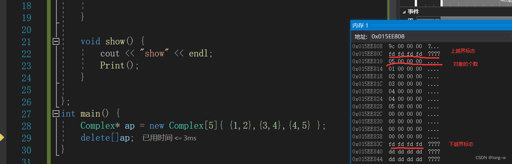
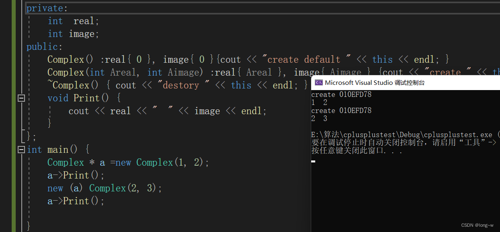

malloc：函数原型void* malloc(size_t size) 参数size为要分配的字节数，返回值是void*,通常要强转为我们需要申请空间的类型,开辟成功回返回空间首地址，失败会返回NULL，但是申请成功后并不进行初始化，每个数据都是随机值。

calloc：函数原型void* calloc(size_t number, size_t size); 参数number为要申请的个数；size为每一个数据的大小，返回值是void*,通常要强转为我们需要申请空间的类型,开辟成功回返回空间首地址，失败会返回NULL，但是申请成功会对空间进行初始化，且初始为0。

realloc：函数原型 void*realloc(void * mem_address, unsigned int newsize); 参数address为要扩展调整的空间首地址，参数newsize为调整为多少字节的空间，返回值是void*,通常要强转为我们需要申请空间的类型,开辟成功回返回空间首地址，失败会返回NULL，但是申请成功后并不进行初始化，每个数据都是随机值。注意的是，之前申请过的空间再用realloc来扩展的话不用释放，只要释放扩展后的空间即可


# new的用法
1. new( ) 分配这种类型的一个大小的内存空间,并以括号中的值来初始化这个变量;
2. new[ ] 分配这种类型的n个大小的内存空间,并用默认构造函数来初始化这些变量;  
char* p=new char[6];     strcpy(p,"Hello");  
3. 当使用new运算符定义一个多维数组变量或数组对象时，它产生一个指向数组第一个元素的指针，返回的类型保持了除最左边维数外的所有维数。

``` cpp
 int *p1 = new int[10];   
返回的是一个指向int的指针int*  
int (*p2)[10] = new int[2][10]; 
new了一个二维数组, 去掉最左边那一维[2], 剩下int[10], 所以返回的是一个指向int[10]这种一维数组的指针int (*)[10]. 

int (*p3)[2][10] = new int[5][2][10];  new了一个三维数组, 去掉最左边那一维[5], 还有int[2][10], 所以返回的是一个指向二维数组int[2][10]这种类型的指针int (*)[2][10].
```

C++中用new动态创建二维数组的格式一般是这样： TYPE (*p)[N] = new TYPE [][N]; 其中，TYPE是某种类型，N是二维数组的列数。采用这种格式，列数必须指出，而行数无需指定。在这里，p的类型是TYPE*[N]，即是指向一个有N列元素数组的指针。
 还有一种方法，可以不指定数组的列数：

## 运算符
### 内置类型使用new
int * ip1 = new int[5]{1,2,3,4,5};

编译器执行的步骤
1.先计算大小，为int类型，有5个则为20个字节
2.从内存中开辟20个字节空间大小
3.把这个空间初始化为1,2,3,4,5
4.把这个空间的地址赋值给ip1

注意下面的不同：


==当我们使用new的时候，new和delete的使用一定要对应==
new    -->delete
new [] --> delete []


## 重定位对象

```cpp
class Complex {
private:
	int  real;
	int image;
public:
	Complex() :real{ 0 }, image{ 0 }{cout << "create default " << this << endl; }
	Complex(int Areal, int Aimage) :real{ Areal }, image{ Aimage } {cout << "create " << this << endl; }
	~Complex() { cout << "destory " << this << endl; }
	void Print() {
		cout << real << "  " << image << endl;
	}
};
int main() {
	Complex * a =new Complex(1, 2);
	a->Print();
	new (a) Complex(2, 3);
	a->Print();

}
```
