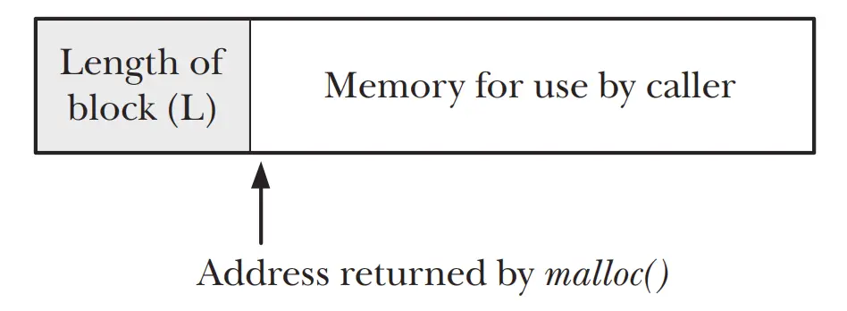

<b>C语言和C++中，为什么malloc函数需要传入申请的内存大小，而free时候却不需要传大小呢？</b>
  

>Looking at the implementation of free(), things start to become more interesting. When free() places a block of memory onto the free list, how does it know what
size that block is? This is done via a trick. When malloc() allocates the block, it allocates extra bytes to hold an integer containing the size of the block. This integer is
located at the beginning of the block; the address actually returned to the caller
points to the location just past this length value, as shown in Figure 7-1.
  

这里讲的就是在malloc返回的申请内存的首地址之前，用额外的字节存储了长度。

所以C语言有个要求就是free()传入的指针一定要是malloc返回的，而不能是其他的。

比如你用malloc申请了20个字节的内存，malloc返回指针p。你想用p+5传入free()，来释放掉后面15个字节内存，抱歉做不到，可能会出现段错误。因为该指针指向的位置前面的内存中的值，会被free视为之前申请的内存的大小。

堆内存可以不free。 但是操作系统也不是 挨个替你调用free函数。

操作系统按page管理内存。

每个进程都有自己的页表。

进程退出的时候，它的页表直接标记为可用就可以了。

之后，其他进程就能继续用那些内存了。

常见的动态内存易错警示
1、不能对NULL指针的解引用操作

因为NULL是一个特殊的指针值，表示指针没有指向任何有效的对象或地址。对NULL指针解引用会导致程序崩溃或未定义的行为，因为程序在试图访问一个不存在的内存地址。

因此，在使用指针之前，应检查其是否为NULL，并确保指向有效的内存地址。

2、不能对动态开辟空间的越界访问

对动态内存的越界访问可能会导致程序崩溃或产生未定义的行为。

这是因为动态内存分配需要在运行时进行，并且程序员需要手动管理内存的分配和释放。如果程序员在访问动态内存时越界，就会导致访问到未分配的内存或者已经释放的内存，从而可能导致程序崩溃或出现未定义的行为。

此外，动态内存的越界访问还可能会导致数据损坏、安全漏洞等问题。因此，程序员需要注意动态内存的边界，并且避免越界访问。

3、不能对非动态内存使用free

因为非动态开辟的内存是在程序运行时从栈上分配的，而不是从堆上分配的。栈上分配的内存是由系统自动管理的，程序员无法控制其释放。因此，如果试图使用free函数来释放栈上的内存，会导致程序崩溃或不可预测的行为。所以只有动态开辟的内存才能使用free函数进行释放。

4、不能对同一块动态内存free多次

对同一块动态内存多次释放会导致程序崩溃或出现未定义的行为。因为在第一次释放后，操作系统会将该内存块标记为可用，此时这块内存空间就可以被其他变量所占用。所以再次释放时该内存块由于已经被标记为可用，所以释放操作将无法成功，从而导致程序出现异常。

此外，多次释放同一块内存还会导致内存泄漏和程序性能下降的风险。因此，程序员需要确保只释放已经分配的内存，且只释放一次。

其中需要注意的是，free释放的是free释放的是内存空间，而不是指针。free之后，指针仍然存在，指针指向也不变，而指针指向的内容要视情况而定，可能存在也可能不存在，具体还要看环境和编译器(VS2022是将其置为随机值的)。所以释放后的输出可能和原来的内容一样，也可能是乱码。但是综合考虑，为了安全起见还是不要有对同一块动态内存多次释放这种操作。

malloc(0)的问题

在C语言中malloc(0)的语法也是对的，而且确实也分配了内存，但是内存空间是0，这个看起来说法很奇怪，但是从操作系统的原理来解释就不奇怪了。

在内存管理中，内存中有栈和堆两个部分，栈有自己的机器指令，是一种先进后出的数据结构。而malloc分配的内存是堆内存，由于堆没有自己的机器指令，所以要由自己编写算法来管理这片内存，通常的做法是用链表在每片被分配的内存前加个表头，里面存储了被分配内存的起始地址和大小。malloc等函数返回的就是表头里的起始指针（这个地址是由一系列的算法得来的，而这些操作又是由编译器的底层为我们做的，我们并不需要关心如何操作）

动态分配内存成功之后，就会返回一个有效的指针。而对于分配0空间来说，算法会得出一个可用内存的起始地址，但可用的空间为0，而操作系统一般不知道其终止地址，一般是根据占用大小来推出终止地址的。所以对malloc(0)返回的指针进行操作就是错误的。
<blockquote>
但需要注意，即使malloc(0)也要记得free掉，因为malloc还会额外分配内存来维护申请的空间，malloc(0)时并不是什么也不做。
</blockquote>

