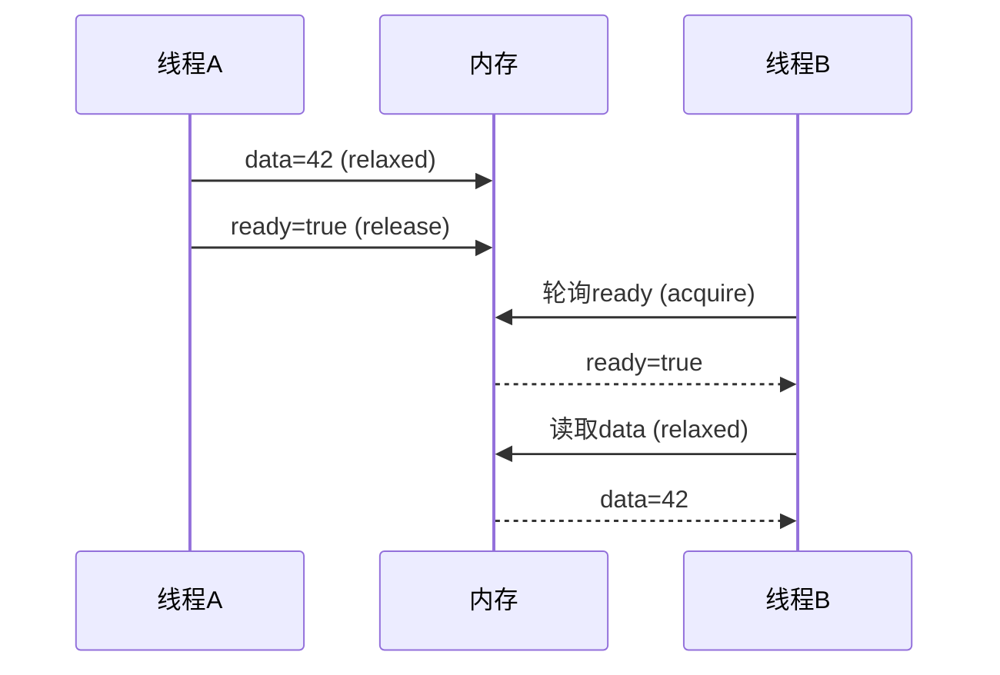
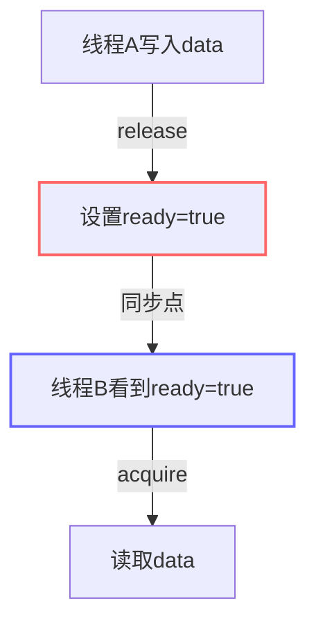

当两个线程同时对一个共享对象进行写入和读取操作时，如果没有正确的同步机制，会导致**数据竞争（Data Race）**和**未定义行为**。下面通过具体例子和底层原理详细解释：

---

### 一、无同步时的危险场景
#### 示例代码：
```cpp
int data = 0;  // 普通变量（非原子）
bool ready = false;  // 普通bool（非原子）

// 线程A（写入）
data = 42;          // ①
ready = true;       // ②

// 线程B（读取）
while(!ready);      // ③
std::cout << data;  // ④
```

#### 可能发生的灾难性结果：
1. **指令重排导致**：
   - 线程A的①②可能被编译器/CPU重排为②→①
   - 导致线程B在③看到`ready=true`时，④却读到`data=0`

2. **内存可见性问题**：
   - 线程A对`data`的修改可能暂时停留在CPU缓存中
   - 线程B直接从内存读取旧值`data=0`

3. **撕裂读/写（Tearing）**：
   - 对于大于机器字长的数据（如结构体），可能读到部分更新的值

---

### 二、`acquire-release`如何解决这个问题
#### 修正后的代码：
```cpp
std::atomic<int> data{0};
std::atomic<bool> ready{false};

// 线程A（写入）
data.store(42, std::memory_order_relaxed);  // ①
ready.store(true, std::memory_order_release); // ②（释放屏障）

// 线程B（读取）
while(!ready.load(std::memory_order_acquire)); // ③（获取屏障）
std::cout << data.load(std::memory_order_relaxed); // ④
```

#### 关键保障机制：
1. **禁止重排**：
   - 线程A：`release`保证①绝不会被重排到②之后
   - 线程B：`acquire`保证④绝不会被重排到③之前

2. **内存可见性**：
   - 当线程B通过`acquire`看到`ready=true`时，**必须**能看到线程A在`release`之前的所有修改（即`data=42`）

3. **硬件层面的保证**：
   - x86：通过缓存一致性协议（MESI）自动同步
   - ARM：自动插入`dmb ish`内存屏障指令



---

### 三、如何理解"看到release之前的所有修改"
#### 1. 编译器层面：
- `release`会阻止编译器将**该操作之前的任何读写**重排到它之后
- `acquire`会阻止编译器将**该操作之后的任何读写**重排到它之前

#### 2. CPU执行层面：
| 阶段 | 线程A | 线程B |
|------|-------|-------|
| 初始 | data=0, ready=false | - |
| 执行 | ① data=42 → ② ready=true | ③ 循环等待 |
| 保证 | ②执行时①的结果必须全局可见 | ③看到②时，必须看到①的结果 |
| 结果 | - | ④必定输出42 |

#### 3. 缓存一致性协议（以x86为例）：
- 线程A的`release`操作会触发缓存行（cache line）的写回
- 线程B的`acquire`操作会强制刷新自己的缓存
- 通过MESI协议保证所有CPU核心看到统一的内存视图

---

### 四、如果不用`acquire-release`会怎样？
#### 实验代码：
```cpp
// 线程A
data.store(42, std::memory_order_relaxed);
ready.store(true, std::memory_order_relaxed);

// 线程B
while(!ready.load(std::memory_order_relaxed));
std::cout << data.load(std::memory_order_relaxed);
```

#### 可能出现的输出：
1. ✅ 42（正常情况）
2. ❌ 0（指令重排导致）
3. ❌ 随机值（内存可见性问题）
4. ❌ 程序卡死（极端情况下的编译器优化）

---

### 五、关键结论
1. **`acquire-release`配对**建立了线程间的**同步关系**，形成"happens-before"约束
2. **`release`**就像"发布公告"：保证之前的操作都完成后再设置标志位
3. **`acquire`**就像"查看公告"：看到标志位后，必须能获取所有已发布的内容
4. 这种机制比互斥锁更轻量，但需要精确控制内存序



掌握这个原理后，你就能：
- 写出正确的无锁数据结构
- 理解C++标准库中`mutex`等同步原语的实现
- 调试复杂的内存可见性问题
- 进行高性能的多线程编程