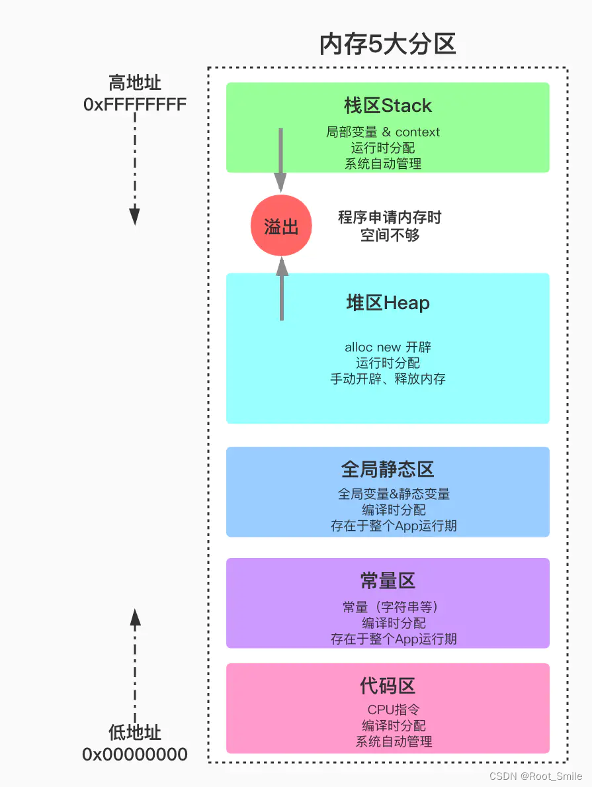

# 内存模型
## 内存的五大分区
1. 堆区（heap）——由程序员分配和释放， 若程序员不释放，程序结束时一般由操作系统回收。注意它与数据结构中的堆是两回事
2. 栈区（stack）——由编译器自动分配释放 ，存放函数的参数值，局部变量等。其操作方式类似于数据结构中的栈
3. 静态全局区
    1. 未初始化静态全局区 —— 静态变量，全局变量，没有初始化的存在此区
    2. 初始化的静态全局区 —— 静态变量、全局变量，赋过初值的存放在此区
4. 文字常量区——常量、字符串就是放在这里的。 程序结束后由系统释放
5. (程序)代码区——用于存放函数体的(二进制)代码



## malloc(0)的问题
在C语言中malloc(0)的语法也是对的，而且确实也分配了内存，但是内存空间是0，这个看起来说法很奇怪，但是从操作系统的原理来解释就不奇怪了。

在内存管理中，内存中有栈和堆两个部分，栈有自己的机器指令，是一种先进后出的数据结构。
而malloc分配的内存是堆内存，由于堆没有自己的机器指令，所以要由自己编写算法来管理这片内存，通常的做法是用链表在每片被分配的内存前加个表头，里面存储了被分配内存的起始地址和大小。
malloc等函数返回的就是表头里的起始指针（这个地址是由一系列的算法得来的，而这些操作又是由编译器的底层为我们做的）

动态分配内存成功之后，就会返回一个有效的指针。而对于分配0空间来说，算法会得出一个可用内存的起始地址，但可用的空间为0，而操作系统一般不知道其终止地址，一般是根据占用大小来推出终止地址的。所以对malloc(0)返回的指针进行操作就是错误的。

==即使malloc(0)也要记得free掉，因为malloc还会额外分配内存来维护申请的空间，malloc(0)时并不是什么也不做==


# 操作系统内存分区详解

## 一、内存分区概述

操作系统将内存划分为不同的区域，每个区域有特定的用途和管理方式。这种分区有助于高效管理内存资源，隔离不同程序的数据，提高系统安全性和稳定性。

## 二、典型内存分区布局（以32位系统为例）

```
+---------------------+ 高地址
|   内核空间          |
|   (Kernel Space)    |
+---------------------+
|   栈区              |
|   (Stack)           |
|   ↓ 增长方向        |
+---------------------+
|   ↓                 |
|   未使用空间        |
|   ↑                 |
+---------------------+
|   堆区              |
|   (Heap)            |
|   ↑ 增长方向        |
+---------------------+
|   未初始化数据区    |
|   (BSS)             |
+---------------------+
|   已初始化数据区    |
|   (Data)            |
+---------------------+
|   代码区            |
|   (Text/Code)       |
+---------------------+ 低地址
```

## 三、详细分区说明

### 1. 内核空间 (Kernel Space)

- **位置**：高地址区域
- **大小**：通常1GB（32位Linux系统）
- **内容**：
  - 操作系统内核代码
  - 设备驱动程序
  - 内核数据结构
- **特点**：
  - 用户程序无法直接访问
  - 需要特权指令才能进入

### 2. 用户空间 (User Space)

#### (1) 代码区 (Text/Code Segment)
- **存储内容**：
  - 程序的可执行指令
  - 只读数据
- **特点**：
  - 通常是只读的
  - 在内存中只有一份副本，多个实例共享

#### (2) 数据区 (Data Segment)
- **已初始化数据区**：
  - 存储全局和静态变量（已初始化）
  - 如：`int globalVar = 10;`
  
- **未初始化数据区 (BSS - Block Started by Symbol)**：
  - 存储未初始化的全局和静态变量
  - 如：`static int uninitVar;`
  - 程序加载时会被初始化为0

#### (3) 堆区 (Heap)
- **管理方式**：动态分配（malloc/new）
- **增长方向**：向高地址增长
- **特点**：
  - 需要手动管理（申请/释放）
  - 分配速度较慢（需要查找合适内存块）
  - 会产生内存碎片

#### (4) 栈区 (Stack)
- **存储内容**：
  - 局部变量
  - 函数调用信息（返回地址、参数等）
- **增长方向**：向低地址增长
- **特点**：
  - 自动管理（函数进入/退出时自动分配释放）
  - 分配速度快（只需移动栈指针）
  - 大小有限（可能导致栈溢出）

#### (5) 内存映射区 (Memory Mapping Segment)
- **存储内容**：
  - 动态链接库
  - 文件映射
  - 共享内存
- **特点**：
  - 由mmap系统调用创建
  - 可用于实现高效的文件I/O

## 四、64位系统的内存布局变化

```
+----------------------+ 高地址
|   内核空间           |
|   (128TB或更多)      |
+----------------------+
|   栈区               |
+----------------------+
|   共享库/内存映射区  |
+----------------------+
|   堆区               |
+----------------------+
|   数据段             |
+----------------------+
|   代码段             |
+----------------------+ 低地址
```

主要区别：
- 地址空间大幅扩展（理论256TB用户空间）
- 内核空间通常位于高地址（与32位系统一致）
- 布局原则类似，但区域间的"空洞"更大

## 五、内存分区管理技术

1. **分页管理**：
   - 将内存划分为固定大小的页（通常4KB）
   - 通过页表实现虚拟地址到物理地址的转换

2. **分段管理**：
   - 按逻辑单元（代码、数据、堆栈等）划分
   - 每个段有独立的基址和长度

3. **段页式管理**：
   - 结合分段和分页的优点
   - 现代操作系统普遍采用

## 六、实际内存分布示例（Linux）

使用`pmap`命令查看进程内存分布：
```
$ pmap -x <pid>
Address           Kbytes     RSS   Dirty Mode  Mapping
00400000       4       4       0 r-x-- program
00600000       4       4       4 rw--- program
00601000    1016       0       0 rw---   [ anon ]
...
7ffc0000000    132      12      12 rw---   [ stack ]
ffffffffff600000       4       0       0 r-x--   [ vsyscall ]
```

## 七、关键点总结

1. **隔离性**：内核空间与用户空间隔离保证系统安全
2. **增长方向**：
   - 栈向低地址增长
   - 堆向高地址增长
3. **管理方式**：
   - 栈：自动管理，效率高
   - 堆：手动管理，灵活但易出错
4. **共享机制**：
   - 代码段可共享
   - 内存映射区支持文件共享

理解内存分区对于系统编程、性能优化和调试都非常重要，特别是在处理内存相关错误（如段错误、内存泄漏）时。