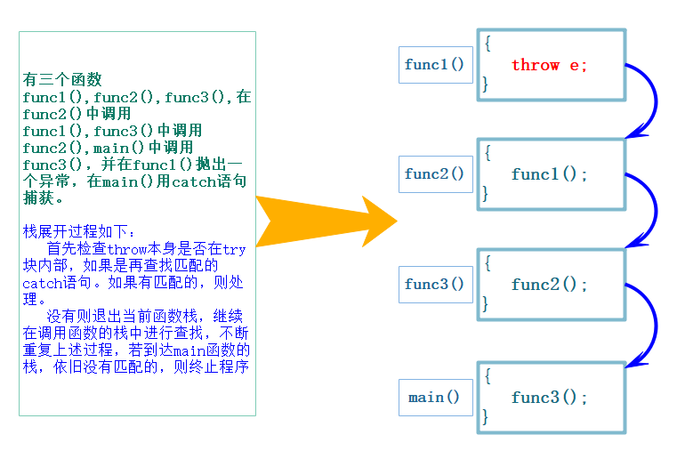

# c++异常处理
## 传统的错误处理机制
- 终止程序，如 assert，缺陷：用户难以接受，除 0 错误时就会终止程序。
- 返回错误码，缺陷：需要程序员自己去查找对应的错误。如系统的很多库的接口函数都是通过把错误码放到errno中，表示错误。
实际中 C 语言基本都是使用返回错误码的方式处理错误，部分情况下使用终止程序处理非常严重的错误。


## C++ 异常概念
异常是一种处理错误的方式，当一个函数发现自己无法处理的错误时就可以抛出异常，让函数的直接或间接的调用者处理这个错误。
- throw：当问题出现时，程序会抛出一个异常。这是通过使用 throw 关键字来完成的。
- catch：在您想要处理问题的地方，通过异常处理程序捕获异常。catch 关键字用于捕获异常，可以有多个 catch 进行捕获。
= try：try 块中的代码标识将被激活的特定异常，它后面通常跟着一个或多个 catch 块。
如果有一个块抛出一个异常，捕获异常的方法会使用 try 和 catch 关键字。try 块中放置可能抛出异常的代码，try 块中的代码被称为保护代码。使用 try / catch 语句的语法如下所示：

```cpp
 try
{
  // 保护的标识代码
}
 catch( ExceptionName e1 )
{
  // catch 块
}
 catch( ExceptionName e2 )
{
  // catch 块
}
 catch( ExceptionName eN )
{
  // catch 块
}
 catch( ... ) //捕获任意类型异常，防止某个异常直到程序结束都没被捕获
{
  // catch 块
  cout << "Unkown Exception" << endl;
}

```

## 异常的抛出和捕获
### 异常的抛出和匹配原则
异常是通过==抛出对象==而引发的，该对象的类型决定了应该激活哪个catch的处理代码。
==被选中的处理代码是调用链中与该对象类型匹配且离抛出异常位置最近的那一个==
抛出异常对象后，会生成一个异常对象的拷贝，因为抛出的异常对象可能是一个临时对象，所以会生成一个拷贝对象，这个拷贝的临时对象会在被 catch 以后销毁。（这里的处理类似于函数的传值返回）
catch(…) 可以捕获任意类型的异常，问题是不知道异常错误是什么。
实际中抛出和捕获的匹配原则有个例外，并不都是类型完全匹配，可以==抛出派生类对象，使用基类捕获==，这个在实际中非常实用。
==在函数调用链中异常栈展开匹配原则==

首先检查 throw 本身是否在 try 块内部，如果是再查找匹配的 catch 语句。如果有匹配的，则调到 catch 的地方进行处理。
没有匹配的 catch 则退出当前函数栈，继续在调用函数的栈中进行查找匹配的 catch。
如果到达 main 函数的栈，依旧没有匹配的，则终止程序。上述这个沿着调用链查找匹配的 catch 子句的过程称为栈展开。所以实际中我们最后都要加一个 catch(…) 捕获任意类型的异常，否则当有异常没捕获，程序就会直接终止。
找到匹配的 catch 子句并处理以后，会继续沿着 catch 子句后面继续执行。


## 异常安全
构造函数完成对象的构造和初始化，最好不要在构造函数中抛出异常，否则可能导致对象不完整或没有完全初始化。
析构函数主要完成资源的清理，最好不要在析构函数内抛出异常，否则可能导致资源泄漏（内存泄漏，句柄未关闭等）。
C++ 中异常经常会导致资源泄漏的问题，比如在 new 和 delete 中抛出了异常，导致内存泄漏，在 lock 和 unlock 之间抛出了异常导致死锁，C++ 经常使用 RAII 来解决以上问题。

## 异常规范
异常规格说明的目的是为了让函数使用者知道该函数可能抛出的异常有哪些。可以在函数的后面接 throw(类型) ，列出这个函数可能抛掷的所有异常类型。
函数的后面接 throw() ，表示函数不抛异常。
若无异常接口声明，则此函数可以抛掷任何类型的异常。
```cpp
// 这里表示这个函数会抛出A/B/C/D中的某种类型的异常
void fun() throw(A，B，C，D);
// 这里表示这个函数只会抛出bad_alloc的异常
void* operator new (std::size_t size) throw(std::bad_alloc);
// 这里表示这个函数不会抛出异常
void* operator delete (std::size_t size, void* ptr) throw();

// C++11 中新增的noexcept，表示不会抛异常
thread() noexcept;
thread(thread&& x) noexcept;
```

## 自定义异常经典场景：抛出的派生类对象， 使用基类捕获
```cpp
// 服务器开发中通常使用的异常继承体系
class Exception
{
public:
	Exception(const string& errmsg, int id)
		:_errmsg(errmsg)
		, _id(id)
	{}

	virtual string what() const
	{
		return _errmsg;
	}
protected:
	string _errmsg;
	int _id;
};

class SqlException : public Exception   //数据库模块
{
public:
	SqlException(const string& errmsg, int id, const string& sql)
		:Exception(errmsg, id)
		, _sql(sql)
	{}

	virtual string what() const
	{
		string str = "SqlException:";    //表示是数据库模块的问题
		str += _errmsg;
		str += "->";
		str += _sql;

		return str;
	}

private:
	const string _sql;
};

class CacheException : public Exception
{
public:
	CacheException(const string& errmsg, int id)
		:Exception(errmsg, id)
	{}

	virtual string what() const
	{
		string str = "CacheException:";
		str += _errmsg;
		return str;
	}
};

class HttpServerException : public Exception
{
public:
	HttpServerException(const string& errmsg, int id, const string& type)
		:Exception(errmsg, id)
		, _type(type)
	{}

	virtual string what() const
	{
		string str = "HttpServerException:";
		str += _type;
		str += ":";
		str += _errmsg;

		return str;
	}

private:
	const string _type;
};


void SQLMgr()
{
	srand(time(0));
	if (rand() % 7 == 0)
	{
		throw SqlException("权限不足", 100, "select * from name = '张三'");
	}

	//throw "xxxxxx";

	cout << "执行成功" << endl;
}

void CacheMgr()
{
	srand(time(0));
	if (rand() % 5 == 0)
	{
		throw CacheException("权限不足", 100);
	}
	else if (rand() % 6 == 0)
	{
		throw CacheException("数据不存在", 101);
	}

	SQLMgr();
}

void HttpServer()
{
	// ...
	srand(time(0));
	if (rand() % 3 == 0)
	{
		throw HttpServerException("请求资源不存在", 100, "get");
	}
	else if (rand() % 4 == 0)
	{
		throw HttpServerException("权限不足", 101, "post");
	}

	CacheMgr();
}
int main()
{
	while (1)
	{
		Sleep(500);

		try {
			HttpServer();
		}
		catch (const Exception& e) // 这里捕获父类对象就可以
		{
			// 多态
			cout << e.what() << endl;
		}
		catch (...)
		{
			cout << "Unkown Exception" << endl;
		}
	}

	return 0;
}

```