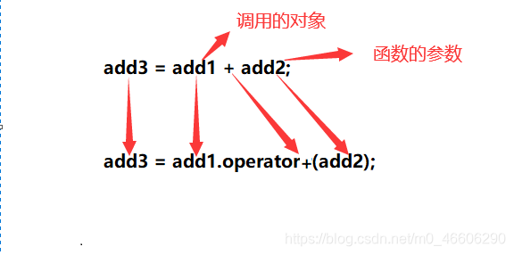

# 重载运算符

```cpp
class Add
{
public:
	int a;
	int b;
	//c++加号运算符重载之后的样子
	Add operator+ (Add & add)
{ 	// 里面的具体实现，要符合加号的常规思维，是加就加哈。
	Add temp;
	temp.a = this->a + add.a;
	temp.b = this->b +add.b;
	return temp;	
}

};
int main ( )
{	//创建了一个Add类的对象
	Add add1; 
	//给对象的成员变量赋值
	add1.a = 10;
	add1.b = 10;
	
	//创建了一个Add类的对象
	Add add2;
	//给对象的成员变量赋值
	add2.a = 10;
	add2.b = 10;

	Add add3;
	//等价于 add3 = add1.operator+ (add2);
	add3 =add1 + add2; 
	
	return 0;
}
```



```cpp
	Add operator+ (Add & add1，Add& add2)
{ 	// 里面的具体实现，要符合加号的常规思维，是加就加哈。
	Add temp;
	temp.a = add1.a + add2.a;
	temp.b = add1.b +add2.b;
	return temp;	
}
//调用
//本质：add3 = operator+(add1,add2)；
add3 = add1 + add2;

```