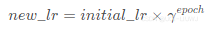

<!-- @import "[TOC]" {cmd="toc" depthFrom=1 depthTo=6 orderedList=false} -->

<!-- code_chunk_output -->

- [optimizer设置](#optimizer设置)
  - [optimizer.zero_grad()](#optimizerzero_grad)
  - [loss.backward()：](#lossbackward)
  - [optimizer.param_groups用法的示例分析](#optimizerparam_groups用法的示例分析)
    - [动态修改学习率](#动态修改学习率)
    - [不同层使用不同的学习率](#不同层使用不同的学习率)
    - [网络层对象为单位进行分组，并设定学习率](#网络层对象为单位进行分组并设定学习率)
    - [torch.optim.lr_scheduler.StepLR()函数](#torchoptimlr_schedulersteplr函数)

<!-- /code_chunk_output -->


# optimizer设置


PyTorch 提供了多种优化算法，以下是一些常用的优化器（optimizer）：

1. **SGD (Stochastic Gradient Descent)**:
   - `torch.optim.SGD`
   - 随机梯度下降是最基础的优化算法，适用于大多数优化问题。

2. **Adam (Adaptive Moment Estimation)**:
   - `torch.optim.Adam`
   - Adam 是一种自适应学习率的优化算法，通常在训练深度学习模型时表现良好。

3. **RMSprop (Root Mean Square Propagation)**:
   - `torch.optim.RMSprop`
   - RMSprop 是一种自适应学习率方法，特别适用于非平稳目标。

4. **Adadelta**:
   - `torch.optim.Adadelta`
   - Adadelta 是一种自适应学习率的优化算法，类似于 Adagrad。

5. **Adagrad (Adaptive Gradient)**:
   - `torch.optim.Adagrad`
   - Adagrad 调整每个参数的学习率，使得之前频繁更新的参数在后续更新中放慢速度。

6. **ASGD (Average Stochastic Gradient Descent)**:
   - `torch.optim.ASGD`
   - ASGD 是 SGD 的变体，它计算平均梯度并使用其来更新权重。

7. **Adamax**:
   - `torch.optim.Adamax`
   - Adamax 是 Adam 的变体，使用无限长指数衰减的梯度平均值来调整学习率。

8. **Adafactor**:
   - `torch.optim.Adafactor`
   - Adafactor 是一种参数效率和内存效率都很高的自适应学习率优化算法。

9. **NAdam (Nesterov Adam)**:
   - `torch.optim.NAdam`
   - NAdam 是 Adam 的变体，使用 Nesterov 动量。

10. **Rprop (Resilient Backpropagation)**:
    - `torch.optim.Rprop`
    - Rprop 是一种自适应学习率的优化算法，适用于某些特定的优化问题。

11. **LBFGS (Limited-memory Broyden–Fletcher–Goldfarb–Shanno)**:
    - `torch.optim.LBFGS`
    - LBFGS 是一种基于拟牛顿方法的优化算法，适用于小数据集或凸优化问题。

每种优化器都有其特定的参数，可以根据具体任务和模型进行调整。以下是一些常见的参数：

- `lr` (学习率): 控制每次更新的步长。
- `momentum`: 动量项，用于加速梯度方向的更新。
- `weight_decay`: L2 正则化项，用于防止过拟合。
- `eps`:   用于数值稳定性的小常数。
- `betas`: 两个时刻估计的指数衰减率（对于 Adam 和 Adamax）。


```py
model     = MyModel()
criterion = nn.CrossEntropyLoss()
optimizer = torch.optim.SGD(model.parameters(), lr=0.001, momentum=0.9, weight_decay=1e-4)
 
for epoch in range(1, epochs):
    for i, (inputs, labels) in enumerate(train_loader):
        output = model(inputs)
        loss   = criterion(output, labels)
        
        # compute gradient and do SGD step
        optimizer.zero_grad()
        loss.backward()
        optimizer.step()
```
这三个函数的作用是先将梯度归零（optimizer.zero_grad()），然后反向传播计算得到每个参数的梯度值（loss.backward()），最后通过梯度下降执行一步参数更新（optimizer.step()）

param_group['params']：由传入的模型参数组成的列表，即实例化Optimizer类时传入该group的参数，如果参数没有分组，则为整个模型的参数model.parameters()，每个参数是一个torch.nn.parameter.Parameter对象。

## optimizer.zero_grad()
```py
    def zero_grad(self):
        r"""Clears the gradients of all optimized :class:`torch.Tensor` s."""
        for group in self.param_groups:
            for p in group['params']:
                if p.grad is not None:
                    p.grad.detach_()
                    p.grad.zero_()
```

optimizer.zero_grad()函数会遍历模型的所有参数，通过p.grad.detach_()方法截断反向传播的梯度流，再通过p.grad.zero_()函数将每个参数的梯度值设为0，即上一次的梯度记录被清空。
因为训练的过程通常使用mini-batch方法，所以如果不将梯度清零的话，梯度会与上一个batch的数据相关，因此该函数要写在反向传播和梯度下降之前。

## loss.backward()：
PyTorch的反向传播(即tensor.backward())是通过autograd包来实现的，autograd包会根据tensor进行过的数学运算来自动计算其对应的梯度。

具体来说，torch.tensor是autograd包的基础类，如果你设置tensor的requires_grads为True，就会开始跟踪这个tensor上面的所有运算，如果你做完运算后使用tensor.backward()，所有的梯度就会自动运算，tensor的梯度将会累加到它的.grad属性里面去。

更具体地说，损失函数loss是由模型的所有权重w经过一系列运算得到的，若某个w的requires_grads为True，则w的所有上层参数（后面层的权重w）的.grad_fn属性中就保存了对应的运算，然后在使用loss.backward()后，会一层层的反向传播计算每个w的梯度值，并保存到该w的.grad属性中。

如果没有进行tensor.backward()的话，梯度值将会是None，因此loss.backward()要写在optimizer.step()之前。


## optimizer.param_groups用法
optimizer.param_groups： 是一个list，其中的元素为字典；
optimizer.param_groups[0]：长度为7的字典，包括[‘params’, ‘lr’, ‘betas’, ‘eps’, ‘weight_decay’, ‘amsgrad’, ‘maximize’]
下面Adam优化器创建了一个optimizer变量：
```py
optimizer.param_groups[0].keys()
dict_keys(['params', 'lr', 'betas', 'eps', 'weight_decay', 'amsgrad', 'maximize'])
```
### 动态修改学习率
```cpp
for param_group in optimizer.param_groups:
    param_group["lr"] = lr 
```

### 不同层使用不同的学习率
```py
optimizer = optim.SGD(
    [{'params': net.features.parameters()},  # 学习率为1e-5
     {'params': net.classifiter.parameters(), 'lr': 1e-2}], lr=1e-5
)
```
### 网络层对象为单位进行分组，并设定学习率
```py
# 只为两个全连接层设置较大的学习率，其余层的学习率较小
# 以层为单位，为不同层指定不同的学习率

# 提取指定层对象
special_layers        = nn.ModuleList([net.classifiter[0], net.classifiter[3]])
# 获取指定层参数id
special_layers_params = list(map(id, special_layers.parameters()))
# 获取非指定层的参数id
base_params = filter(lambda p: id(p) not in special_layers_params, net.parameters())

optimizer = t.optim.SGD([
    {'params': base_params},
    {'params': special_layers.parameters(), 'lr': 0.01}], lr=0.001)
```


## 学习率调整方案

### torch.optim.lr_scheduler.StepLR()函数
torch.optim.lr_scheduler模块提供了一些根据epoch训练次数来调整学习率（learning rate）的方法。
一般情况下我们会设置随着Epoch的增大而逐渐减小学习率从而达到更好的训练效果。 


**torch.optim.lr_scheduler.StepLR(optimizer, step_size, gamma=0.1, last_epoch=-1)**

1. optimizer （Optimizer）：要更改学习率的优化器  
2. step_size（int）       ：每训练step_size个epoch，更新一次参数  
3. gamma（float）         ：更新lr的乘法因子  
4. last_epoch （int）     ：最后一个epoch的index，如果是训练了很多个epoch后中断了，继续训练，这个值就等于加载的模型的epoch。
默认为-1表示从头开始训练，即从epoch=1开始。

学习率衰减函数：每训练n个epoch，学习率衰减为原来的1/x 

==print("初始化的学习率：", optimizer_1.defaults['lr'])==
```python
from torch import optim
optimizer_ft=optim.Adam(params_to_update,lr=1e-2)
scheduler=optim.lr_scheduler.StepLR(optimizer_ft,step_size=n,gamma=0.1) #每训练n个epoch，学习率衰减为原来的1/10

initial_lr = 0.1

net_1=nn.Sequential(nn.Linear(1,10))
 
optimizer_1 = torch.optim.Adam(net_1.parameters(), lr = initial_lr)
 
scheduler_1 = StepLR(optimizer_1, step_size=3, gamma=0.1)
 
print("初始化的学习率：", optimizer_1.defaults['lr'])
lst=[]
for epoch in range(1, 11):
    # train
    optimizer_1.zero_grad()
    optimizer_1.step()
    print("第%d个epoch的学习率：%f" % (epoch, optimizer_1.param_groups[0]['lr']))
    lst.append( optimizer_1.param_groups[0]['lr'])
    scheduler_1.step()
```

### torch.optim.lr_scheduler.LambdaLR函数

1. optimizer （Optimizer）：要更改学习率的优化器
2. lr_lambda（function or list）：根据epoch计算λ的函数
3. last_epoch （int）：最后一个epoch的index，默认为-1表示从头开始训练，即从epoch=1开始。
```py

def lr_lambda(epoch):
    if epoch < 10:
        return 1.0  # 前 10 个 epoch 使用原始学习率
    elif epoch < 20:
        return 0.1  # 接下来的 10 个 epoch 学习率乘以 0.1
    else:
        return 0.01  # 之后的 epoch 学习率乘以 0.01

scheduler_1 = LambdaLR(
    optimizer_1, 
    lr_lambda=lambda epoch: 1/(epoch+1))
```

###  torch.optim.lr_scheduler.MultiStepLR函数
```py
torch.optim.lr_scheduler.MultiStepLR(
    optimizer,
    milestones, 
    gamma=0.1, 
    last_epoch=-1)
```
1. optimizer （Optimizer）：要更改学习率的优化器；
2. milestones（list）：递增的list，存放要更新lr的epoch；
   在milestones里面的这几个点时相继乘以gamma系数
3. gamma（float）：更新lr的乘法因子；
4. last_epoch （int）：最后一个epoch的index，如果是训练了很多个epoch后中断了，继续训练，这个值就等于加载的模型的epoch。默认为-1表示从头开始训练，即从epoch=1开始。
```py

scheduler_1 = MultiStepLR(
    optimizer_1,
    milestones=[3,9],
    gamma=0.1)
```


### torch.optim.lr_scheduler.ExponentialLR函数
```py
torch.optim.lr_scheduler.ExponentialLR(
    optimizer, 
    gamma, 
    last_epoch=-1)
```
1. optimizer （Optimizer）：要更改学习率的优化器；
2. gamma（float）：更新lr的乘法因子；
3. last_epoch （int）：最后一个epoch的index，如果是训练了很多个epoch后中断了，继续训练，这个值就等于加载的模型的epoch。默认为-1表示从头开始训练，即从epoch=1开始。


