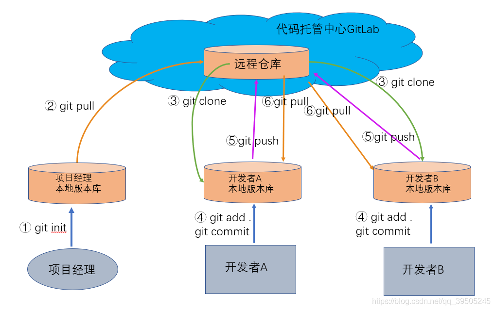

<!-- @import "[TOC]" {cmd="toc" depthFrom=1 depthTo=6 orderedList=false} -->

<!-- code_chunk_output -->

- [Git 指令](#git-指令)
  - [Git 配置](#git-配置)
    - [Git 的全局配置](#git-的全局配置)
    - [查看配置效果](#查看配置效果)
    - [Git 的局部配置](#git-的局部配置)
  - [本地仓库](#本地仓库)
    - [查看工作区和暂存区的状态](#查看工作区和暂存区的状态)
    - [将文件从暂存区中剔除掉](#将文件从暂存区中剔除掉)
  - [远程仓库](#远程仓库)
    - [添加远程仓库](#添加远程仓库)
    - [删除远程仓库](#删除远程仓库)
    - [删除远程分支](#删除远程分支)
    - [从远程获取代码](#从远程获取代码)
    - [分支版本上传到远程并合并](#分支版本上传到远程并合并)
  - [分支管理](#分支管理)
    - [查看当前分支](#查看当前分支)
    - [切换分支](#切换分支)
    - [新建分支](#新建分支)
    - [删除分支](#删除分支)
    - [合并分支](#合并分支)
    - [查看分支合并情况](#查看分支合并情况)
  - [标签管理](#标签管理)
    - [创建附注标签](#创建附注标签)
    - [删除标签](#删除标签)
    - [推送到远程仓库](#推送到远程仓库)
    - [删除远程仓库的标签](#删除远程仓库的标签)
    - [检出标签](#检出标签)
  - [git 的历史版本查看与版本回退](#git-的历史版本查看与版本回退)
    - [git 历史查看命令](#git-历史查看命令)
    - [git 版本回退命令](#git-版本回退命令)
  - [Using a USB memory stick/HDD](#using-a-usb-memory-stickhdd)

<!-- /code_chunk_output -->

# Git 指令

## Git 配置

git 的配置分为两种：

1. 全局配置 ： （系统用户级别，作用范围是登录当前用户权限）
2. 局部配置 ： （项目级别或者叫仓库级别，仅在当前的本地库有效）

### Git 的全局配置

```py
配置用户名:
git config --global user.name  northcastle

配置邮箱:
git config --global user.email northcastle@163.com
```

### 查看配置效果

```py
git config --list
```

### Git 的局部配置

```py
设置当前仓库的用户名标识:
git config user.name northcastle_local

设置当前仓库的邮箱标识:
git config user.email northcastle_local@163.com
```

## 本地仓库

具体的本地仓库提交的流程图如下：


### 查看工作区和暂存区的状态

```
git status
```

撤销工作区修改
BASH

```py
- 放弃单个文件修改
git restore filename.txt

- 放弃所有修改
git restore .
```

### 将文件从暂存区中剔除掉

```py
git rm --cached [文件名]
```

## 远程仓库



### 添加远程仓库

```py
git remote add 远程仓库的别名 远程仓库的地址

例如 ：
git remote add origin git@xxxxxx.git
```

### 删除远程仓库

```
git remote rm 远程仓库的别名
```

### 删除远程分支

```
git push origin --delete remoteBranchName

删除多个远程分支
git push origin --delete feature/branch1 feature/branch2 feature/branch3
```

**本地推送和拉取的方向都是从左到右------------>。**

### 从远程获取代码

```
git pull <远程主机名> <远程分支名>:<本地分支名>
```

### 分支版本上传到远程并合并

```
git push    <远程主机名> <本地分支名>:<远程分支名>
git push -f <远程主机名> <本地分支名>:<远程分支名>
git push -u <远程主机名> <本地分支名>:<远程分支名>
```

## 分支管理

### 查看当前分支

```
git branch
git branch -m old-name new-name   // 修改分支名

```

### 切换分支

```
git checkout <branch>
```

### 新建分支

```
git checkout -b <branch>
```

### 删除分支

```
git branch -d <branch>
git branch -D branch-name // 强制删除
```

### 合并分支

```
git merge <branch>
```

### 查看分支合并情况

```
git log --graph --oneline --decorate
```

## 标签管理

### 创建附注标签

```
git tag 标签名称
git tag 标签名称 提交版本号
git tag -a 标签名称 -m 附注信息
git tag -a 标签名称 提交版本号 -m 附注信息

git show v1.0
说明：
-a : 理解为 annotated 的首字符，表示附注标签
-m : 指定附注信息
git tag -a 标签名称 -m 附注信息 ：直接给当前的提交版本创建一个 【附注标签】
git tag -a 标签名称 提交版本号 -m 附注信息 ：给指定的提交版本创建一个【附注标签】
```

### 删除标签

```
git tag -d 标签名称
```

### 推送到远程仓库

```
git push origin 标签名

git push origin --tags
```

### 删除远程仓库的标签

```
git push origin :refs/tags/标签名称

git push origin --delete 标签名称
```

### 检出标签

```
git checkout -b 分支名称 标签名称
检出标签的理解     ： 我想在这个标签的基础上进行其他的开发或操作。
检出标签的操作实质 ： 就是以标签指定的版本为基础版本，新建一个分支，继续其他的操作。
```

## git 的历史版本查看与版本回退

### git 历史查看命令

```
1.git log                  : 查看详细历史记录，按提交时间倒叙排列，包含提交时间，提交作者，提交备注以及提交的hash值；
2.git log --pretty=oneline : 格式化log形式，每条log只有一行，只包含 完整的hash值 和 提交的备注；
3.git log --oneline        : 格式化log形式，每条log只有一行，只包含 短hash值 和 提交的备注；

【注】2和3的区别就是 展示的hash值的长短，短hash就是完整hash截取了前7位的表示形式。

4.git log -n 3    : 只展示最新的 几条 日志，-n 后面的数字就表示 要展示的条数;
5.git log --graph : 会展示历史提交的分支路线;

【注】 参数可以结合使用!
      比如 git log --oneline -n 3    : 即一行一行的展示+只展示最近的3次提交记录;
      比如 git log --oneline --graph : 即一行一行的展示+展示提交的路线;

6.git reflog      : 展示短hash+HEAD{n}+提交备注，非常方便用来进行历史版本的回退与任意版本的切换；
7.git reflog -n 2 : 表示只看最近的两次提交

【注】 git log 和 git reflog 的区别：
            git log    : 只展示 当前版本之前的版本，即HEAD指针指向的版本及之前的历史版本；
            git reflog : 会展示所有的历史提交版本，非常的全。

8.q : 可以查看历史提交的改动的文件
```

### git 版本回退命令

```
1.git reset --hard 版本号   : 版本号可以是 短hash值 或者 完整hash值
2.git reset --hard HEAD^   : 回退到上一个版本
3.git reset --hard HEAD^^  : 回退到上上个版本
4.git reset --hard HEAD~3  : 回退到上三个版本
```

---

## Using a USB memory stick/HDD

1. git init --bare
   是一个 Git 命令，用于初始化一个新的 Git 仓库，但是这个仓库是空的，没有工作目录。这种类型的仓库通常用作远程仓库，即其他开发者可以推送(push)他们的代码到这个仓库，也可以从这个仓库拉取(pull)代码，但是不能在这个仓库上进行本地开发。
2. git remote add origin /path/to/memory/stick/repoName.git
3. git push origin master
