以下是 **Mermaid** 的核心语法知识整理，涵盖常用图表类型的语法规则和示例：

---

### **1. 基础语法结构**

所有 Mermaid 图表以 `%%{init: {}}%%`（可选配置）和图表类型声明开头，例如：

```mermaid
%%{init: {"theme": "dark"}}%%  <!-- 可选主题配置 -->
graph TD  <!-- 声明图表类型及方向 -->
    A --> B
```

---

### **2. 流程图（Flowchart）**

#### **方向定义**

- `graph TD`：从上到下（Top-Down）
- `graph LR`：从左到右（Left-Right）
- `graph RL`：从右到左
- `graph BT`：从下到上

#### **节点形状**

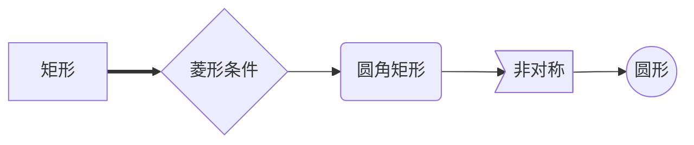

#### **连接线类型**

```mermaid
graph LR
    A --> B           <!-- 实线箭头 -->
    A --- B           <!-- 无箭头实线 -->
    A -.-> B          <!-- 虚线箭头 -->
    A ==> B           <!-- 粗箭头 -->
    A -- 标签 --> B    <!-- 带文字标签 -->
    A -->|多行<br>标签| B
```

#### **子图（Subgraph）**

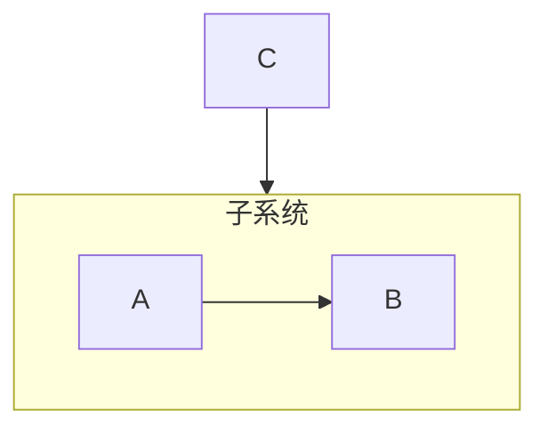

---

### **3. 时序图（Sequence Diagram）**

#### **参与者定义**

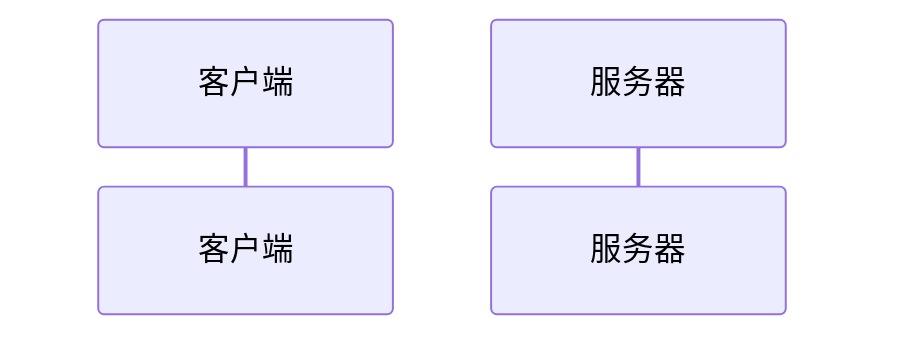

#### **交互类型**

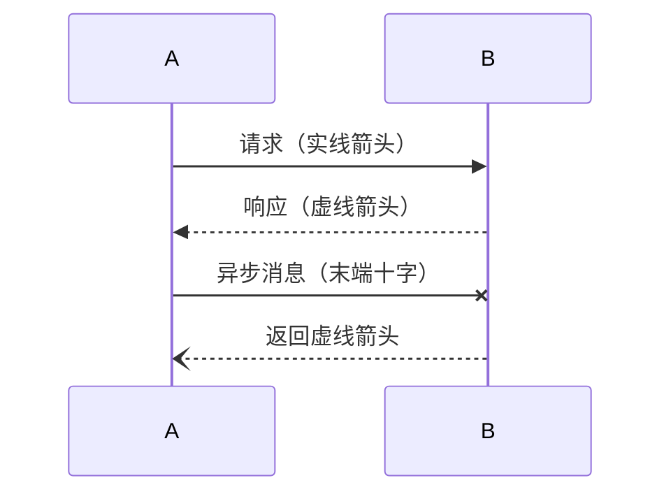

#### **激活条与循环**

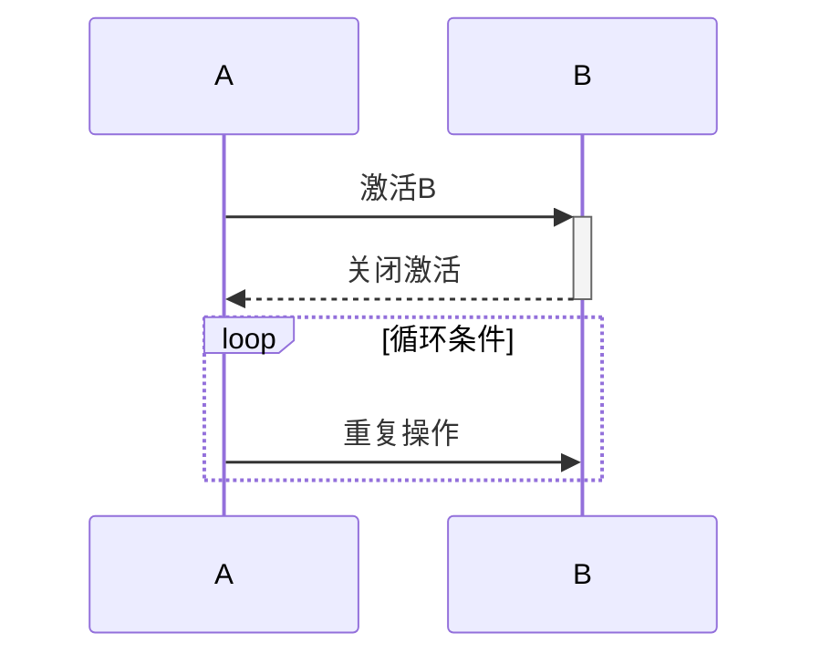

---

### **4. 甘特图（Gantt）**

#### **时间轴与任务定义**

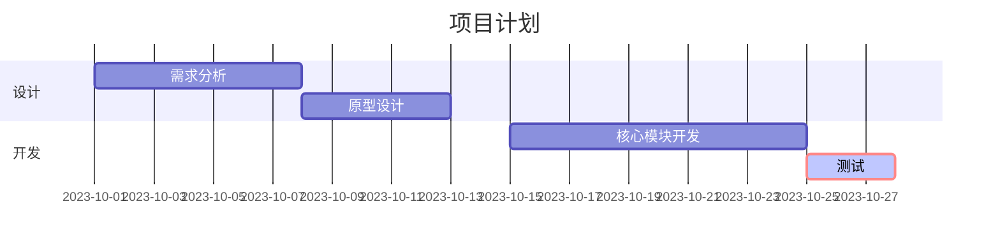

#### **关键参数**

- `crit`：标记关键路径
- `active`：高亮当前任务
- `done`：已完成状态
- `milestone`：里程碑标记

---

### **5. 类图（Class Diagram）**

#### **类与关系**

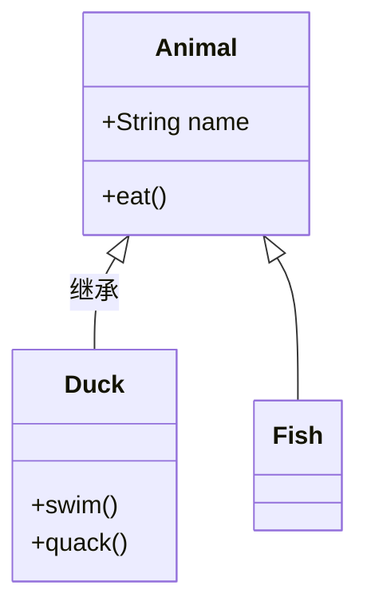

#### **关系类型**

- 继承：`<|--`
- 组合：`*--`（实心菱形）
- 聚合：`o--`（空心菱形）
- 关联：`-->`
- 依赖：`..>`

---

### **6. 状态图（State Diagram）**

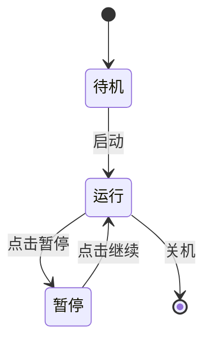

---

### **7. 饼图（Pie Chart）**

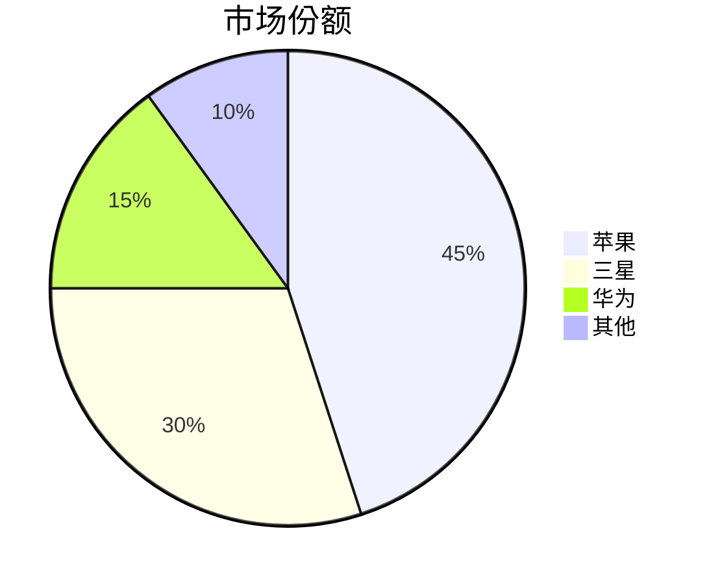

---

### **8. 高级语法技巧**

#### **注释**

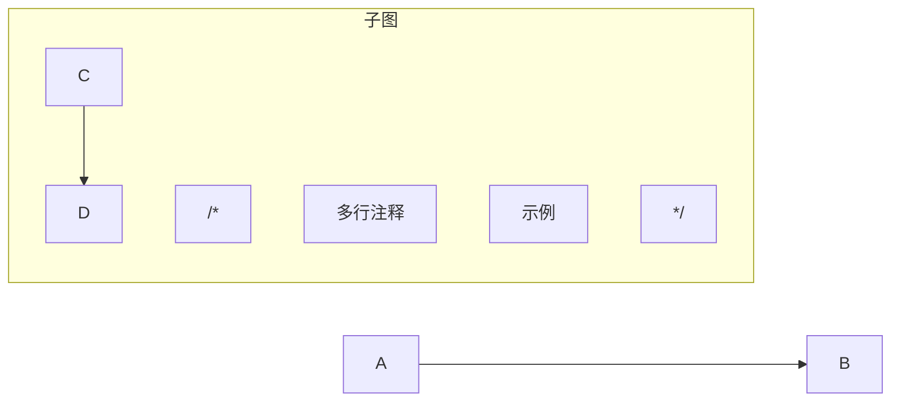

#### **样式定制**

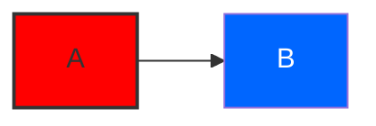

#### **多行文本**

使用 `\n` 或 `` ` `` 包裹文本：

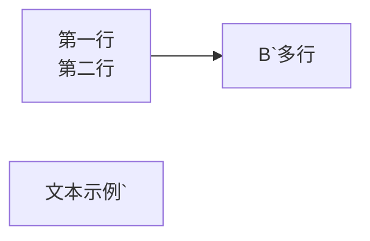

#### **HTML 与 JS 结合**

```html
<div class="mermaid">graph LR A[点击我] --> B click A callback "Tooltip"</div>
<script>
  var callback = function () {
    alert("触发事件!");
  };
</script>
```

Mermaid 中的样式自定义主要通过`classDef`和`class`指令实现，以下是详细语法解析和参数说明：

📌 **基础语法结构**

```mermaid
graph LR
    节点:::类名
    classDef 类名 样式属性键值对
```

🔍 **示例代码解析**


📝 **关键参数说明**

1. **类定义 (`classDef`)**

   - `fill`：填充颜色（支持 HEX/RGB/颜色名称）
     - 示例：`fill:#f00` → 红色填充
   - `stroke`：边框颜色
     - 示例：`stroke:#333` → 深灰色边框
   - `stroke-width`：边框粗细
     - 示例：`stroke-width:2px` → 2 像素边框
   - `color`：文字颜色
     - 示例：`color:white` → 白色文字
   - `stroke-dasharray`：虚线边框
     - 示例：`stroke-dasharray:5,5` → 5 像素间隔虚线

2. **类应用 (`:::`)**
   - 通过`节点:::类名`应用预定义样式
   - 示例：`A:::redBox` → A 节点应用 redBox 样式

🎨 **扩展样式属性**

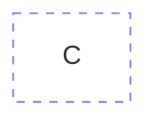

- `font-size`：文字大小
- `font-family`：字体类型
- `font-weight`：文字粗细
- `opacity`：透明度（0-1）

💡 **使用技巧**

1. 颜色简写：`#f00`等效于`#ff0000`
2. 多类应用：`节点:::类1:::类2`
3. 默认类：`classDef default fill:#f9f`
4. 状态类：`classDef :>active fill:#ff0`（需配合交互功能）

📚 **完整示例**

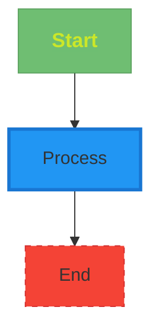
