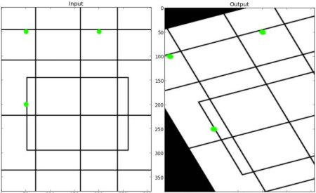

# OpenCV笔记

## OpenCV处理鼠标事件
`event` 和 `flags` 是 OpenCV 鼠标回调函数的参数，它们提供了关于鼠标事件的详细信息：

1. **event**: 这是一个整数，表示发生的鼠标事件类型。OpenCV 定义了多种鼠标事件，其中一些最常见的包括：
   - `cv2.EVENT_LBUTTONDOWN`：鼠标左键按下。
   - `cv2.EVENT_LBUTTONUP`：鼠标左键释放。
   - `cv2.EVENT_LBUTTONDBLCLK`：鼠标左键双击。
   - `cv2.EVENT_MOUSEMOVE`：鼠标移动。
   - `cv2.EVENT_RBUTTONDOWN` 和 `cv2.EVENT_RBUTTONUP`：分别对应鼠标右键的按下和释放。

   在回调函数中，`event` 参数用于确定当前发生的是哪种鼠标操作。

2. **flags**：这是一个整数，表示鼠标事件的附加信息或状态。它通常与鼠标按钮的状态有关。例如：
   - `cv2.EVENT_FLAG_LBUTTON`：鼠标左键被按下。
   - `cv2.EVENT_FLAG_RBUTTON`：鼠标右键被按下。
   - `cv2.EVENT_FLAG_MBUTTON`：鼠标中键被按下（如果鼠标有中键的话）。

   `flags` 参数可以用来获取更多关于鼠标状态的信息，比如哪个按钮被按下，但这通常需要额外的逻辑来检查。


OpenCV 的鼠标回调函数原型如下：
```python
def onMouse(event, x, y, flags, param):
    # 函数体
```
其中，`event`、`x`、`y`、`flags` 和 `param` 是函数的参数。`x` 和 `y` 表示鼠标事件的坐标位置。`param` 是一个额外的参数，它可以是任何 Python 对象，通常用于在回调函数中存储额外的状态信息。

```py{.line-numbers}
import cv2
import numpy as np
#当鼠标按下时为True
drawing = False
#如果mode为true时绘制矩形，按下'm'变成绘制曲线
mode = True
ix,iy = -1,-1

#创建回调函数
def draw_circle(event,x,y,flags,param):
    global ix,iy,drawing,mode
    #当按下左键时返回起始位置坐标
    if event == cv2.EVENT_LBUTTONDOWN:
        drawing = True
        ix,iy=x,y
    #当左键按下并移动时绘制图形，event可以查看移动，flag查看是否按下
    elif event==cv2.EVENT_MOUSEMOVE and flags==cv2.EVENT_FLAG_LBUTTON:
        if drawing == True:
            if mode == True:
                cv2.rectangle(img,(ix,iy),(x,y),(0,255,0),-1)
            else:
                #绘制圆圈，小圆点连在一起就成了线，3代表笔画的粗细
                cv2.circle(img,(x,y),3,(0,0,255),-1)
              
    #当鼠标松开时停止绘图
    elif event ==cv2.EVENT_LBUTTONUP:
        drawing == False

'''
下面把回调函数与OpenCV窗口绑定在一起，在主循环中奖'm'键与模式转换绑定在一起
'''
img = np.zeros((500,500,3),np.uint8)
cv2.namedWindow('image')
cv2.setMouseCallback('image',draw_circle)
while(1):
    cv2.imshow('image',img)
    k=cv2.waitKey(1)
    if k ==ord('m'):
        mode=not mode
    elif k==ord('q'):
        break
cv2.destroyAllWindows()
```

## 获取并修改像素值

使用item()和itemset()方法可以获取和修改图像的像素值。
```python
import cv2
img = cv2.imread('messi5.jpg',0)
print(img.item(10,10,2))
img.itemset((10,10,2),100)
print(img.item(10,10,2))
```

## 获取图像属性

1. img.shape可以获得图像的形状，返回值是一个包含行数，列数，通道数的元组
2. img.size可以返回图像的像素数目
3. img.dtype返回图像的数据类型，在debug时很重要，因为OpenCV-Python代码中经常出现数据类型的不一致
```python
import cv2
img = cv2.imread('messi5.jpg',0)
print(img.shape)
```

## 图像ROI

ROI是“Region of Interest”的缩写，指图像的某一块区域。OpenCV-Python使用Numpy索引来获取ROI。
```python
import cv2
img = cv2.imread('messi5.jpg')
ball = img[280:340,330:390]
```

## 拆分及合并图像通道

有时需要对BGR三个通道分别进行处理，这时可以使用split()和merge()方法。
要注意，split()方法返回的是一个列表，merge()方法需要一个列表作为参数。
**opencv中颜色的通道顺序是BGR，而不是RGB。**
```python
import cv2
img = cv2.imread('messi5.jpg')
b,g,r = cv2.split(img)
img = cv2.merge((b,g,r))
```

## 为图像扩边
想为图像周围建一个边可以使用cv2.copyMakeBorder()函数。这经常在卷积运算或0填充时被用到。具体参数如下：
- src输入图像
- top,bottom,left,right对应边界的像素数目
- borderType要添加哪种类型的边界：
    1. cv2.BORDER_CONSTANT添加有颜色的常数值边界，还需要下一个参数（value）
    2. cv2.BORDER_REFLIECT边界元素的镜像。例如：fedcba | abcdefgh | hgfedcb
    3. cv2.BORDER_101或者cv2.BORDER_DEFAULT跟上面一样，但稍作改动，例如：gfedcb | abcdefgh | gfedcba
    4. cv2.BORDER_REPLICATE复后一个元素。例如: aaaaaa| abcdefgh|hhhhhhh
    5. cv2.BORDER_WRAP 不知怎么了, 就像样: cdefgh| abcdefgh|abcdefg
    6. value边界颜色
```py
import cv2
import numpy
from matplotlib import pyplot as plt
img = cv2.imread('roi.jpg')
blue = [255,0,0]
replicate  = cv2.copyMakeBorder(img,10,10,10,10,cv2.BORDER_REPLICATE)
reflect    = cv2.copyMakeBorder(img,10,10,10,10,cv2.BORDER_REFLECT)
reflect101 = cv2.copyMakeBorder(img,10,10,10,10,cv2.BORDER_REFLECT101)
wrap       = cv2.copyMakeBorder(img,10,10,10,10,cv2.BORDER_WRAP)
constant   = cv2.copyMakeBorder(img,10,10,10,10,cv2.BORDER_CONSTANT,value=blue)

plt.subplot(231),plt.imshow(img,'gray'),plt.title('original')
plt.subplot(232),plt.imshow(replicate,'gray'),plt.title('replicate')
plt.subplot(233),plt.imshow(reflect,'gray'),plt.title('reflect')
plt.subplot(234),plt.imshow(reflect101,'gray'),plt.title('reflect101')
plt.subplot(235),plt.imshow(wrap,'gray'),plt.title('wrap')
plt.subplot(236),plt.imshow(constant,'gray'),plt.title('constant')

plt.show()
```
## 图像加法
使用cv2.add()将两幅图像进行加法运算，也可以直接使用numpy，res=img1+img2.两幅图像的大小，类型必须一致，或者第二个图像可以是一个简单的标量值。
openCV的加法是一种饱和操作，而numpy的加法是一种模操作。
```python
import cv2
import numpy as np
x = np.uint8([250])
y = np.uint8([10])
print(cv2.add(x,y))
print(x+y)
```
## 图像混合
这也是加法，不同的是两幅图像的权重不同，这会给人一种混合或者透明的感觉。
图像混合的计算公式如下：
g(x) = (1−α)f0(x) + αf1(x)    通过修改α的值（0-->1）,可以实现混合。

```py
import cv2
import numpy as np
img1=cv2.imread('45.jpg')
img2=cv2.imread('messigray.png')

dst = cv2.addWeighted(img1,0.7,img2,0.3,0)

cv2.imshow('dst',dst)
cv2.waitKey(0)
cv2.destroyAllWindows()
```

## 按位运算
按位运算包括AND，OR，NOT和XOR等。它们是对图像的二进制位进行操作。
```py

```


## 转换颜色空间
在 OpenCV 中有 超过150 种进行颜色空间转换的方法。但是你以后就会发现我们经常用到的也就两种：BGR↔Gray 和 BGR↔HSV。
我们用到的函数是cv2.cvtColor(input_image,flag)，其中flag就是转换类型。
对于BGR↔Gray的转换，我们使用的flag就是cv2.COLOR_BGR2GRAY。
对于 BGR↔HSV的转换我们用的flag就是cv2.COLOR_BGR2HSV。


在 OpenCV 的 HSV 格式中，H（色彩/色度）的取值范围是 [0，179]， S（饱和度）的取值范围 [0，255]，V（亮度）的取值范围 [0，255]。但是不同的软件使用的值可能不同。所以当你拿 OpenCV 的 HSV 值与其他软件的 HSV 值对比时，一定要记得归一化。

### 物体跟踪
• 从视频中获取每一帧图像
• 将图像换到 HSV 空间
• 设置 HSV 阀值到蓝色范围。
• 获取蓝色物体，当然我们可以做其他任何我们想做的事，比如：在蓝色物体周围画一个圈。
```py
import cv2
import numpy as np

cap = cv2.VideoCapture(0)

while(1):
    #获取每一帧
    ret,frame = cap.read()
    #转换到HSV
    hsv = cv2.cvtColor(frame,cv2.COLOR_BGR2HSV)
    #设定蓝色的阀值
    lower_blue = np.array([110,50,50])
    upper_blue = np.array([130,255,255])
    #根据阀值构建掩模
    mask = cv2.inRange(hsv,lower_blue,upper_blue)
    #对原图和掩模进行位运算
    res = cv2.bitwise_and(frame,frame,mask=mask)
    #显示图像
    cv2.imshow('frame',frame)
    cv2.imshow('mask',mask)
    cv2.imshow('res',res)
    k = cv2.waitKey(5)&0xFF
    if k == 27:
        break
#关闭窗口
cv2.destroyAllWindows()
```

## 扩展缩放
改变图像的尺寸大小，cv2.resize()可以实现这个功能。在缩放时推荐cv2.INTER_AREA，在拓展时推荐cv2.INTER_CUBIC（慢）和cv2.INTER_LINEAR。默认情况下所有改变图像尺寸大小的操作使用的是插值法都是cv2.INTER_LINEAR。
```py
import cv2

img = cv2.imread('45.jpg')
#下面的None本应该是输出图像的尺寸，但是因为后面我们设置了缩放因子，所以，这里为None
res = cv2.resize(img,None,fx=2,fy=2,interpolation=cv2.INTER_CUBIC)

#这里直接设置输出图像的尺寸，所以不用设置缩放因子
height , width =img.shape[:2]
res = cv2.resize(img,(2*width,2*height),interpolation=cv2.INTER_CUBIC)

while(1):
    cv2.imshow('res',res)
    cv2.imshow('img',img)

    if cv2.waitKey(1)&0xFF == 27:
        break
cv2.destroyAllWindows()
```

## 图像平移
如果想要沿（x，y）方向移动，移动的距离为（tx,ty）可以以下面方式构建移动矩阵。

可以使用Numpy数组构建矩阵，数据类型是np.float32，然后传给函数cv2.warpAffine()
函数cv2.warpAffine() 的第三个参数的是输出图像的大小，它的格式
应该是图像的（宽，高）。应该记住的是图像的宽对应的是列数，高对应的是行数。
```py
import numpy as np
import cv2 as cv
img = cv.imread('messi5.jpg',0)
rows,cols = img.shape
M = np.float32([[1,0,100],[0,1,50]])
dst = cv.warpAffine(img,M,(cols,rows))
cv.imshow('img',dst)
cv.waitKey(0)
cv.destroyAllWindows()
```

## 图像旋转

要旋转一个图像，需要一个旋转矩阵。在这个矩阵中你需要选择一个旋转中心，一个旋转角度和一个旋转比例。
可以通过函数cv2.getRotationMatrix2D()构建这个旋转矩阵。
函数cv2.getRotationMatrix2D() 的第一个参数为旋转中心，第二个为旋转角度，第三个为旋转比例。
```py
img = cv.imread('messi5.jpg',0)
rows,cols = img.shape
# cols-1 and rows-1 are the coordinate limits.
M = cv.getRotationMatrix2D(((cols-1)/2.0,(rows-1)/2.0),90,1)
dst = cv.warpAffine(img,M,(cols,rows))
```


## 仿射变换
在仿射变换中，原图中所有的平行线在结果图像中同样平行。为了创建这个矩阵我们需要从原图像中找到三个点以及他们在输出图像中的位置。
然后cv2.getAffineTransform 会创建一个2x3 的矩阵，最后这个矩阵会被传给函数cv2.warpAffine。

```py
img = cv.imread('drawing.png')
rows,cols,ch = img.shape
pts1 = np.float32([[50,50],[200,50],[50,200]])
pts2 = np.float32([[10,100],[200,50],[100,250]])
M = cv.getAffineTransform(pts1,pts2)
dst = cv.warpAffine(img,M,(cols,rows))
plt.subplot(121),plt.imshow(img),plt.title('Input')
plt.subplot(122),plt.imshow(dst),plt.title('Output')
plt.show()
```
## 透视变换
对于视角变换，我们需要一个3x3变换矩阵。在变换前后直线还是直线。需要在原图上找到4个点，以及他们在输出图上对应的位置，这四个点中任意三个都不能共线，可以有函数cv2.getPerspectiveTransform()构建，然后这个矩阵传给函数cv2.warpPerspective()
```py
img = cv.imread('sudoku.png')
rows,cols,ch = img.shape
pts1 = np.float32([[56,65],[368,52],[28,387],[389,390]])
pts2 = np.float32([[0,0],[300,0],[0,300],[300,300]])
M = cv.getPerspectiveTransform(pts1,pts2)
dst = cv.warpPerspective(img,M,(300,300))
plt.subplot(121),plt.imshow(img),plt.title('Input')
plt.subplot(122),plt.imshow(dst),plt.title('Output')
plt.show()
```

## 简单阈值
当像素值高于阈值时，我们给这个像素赋予一个新值（可能是白色），否则我们给它赋予另外一种颜色（也许是黑色）。
这个函数就是cv2.threshold()。这个函数的第一个参数就是原图像，原图像应该是灰度图。第二个参数就是用来对像素值进行分类的阈值，第三个参数就是当像素值高于（或者小于）阈值时，应该被赋予新的像素值。OpenCV提供了多种不同的阈值方法，这是有第四个参数来决定的。方法包括：
cv2.THRESH_BINARY
cv2.THRESH_BINARY_INV
cv2.THRESH_TRUNC
cv2.THRESH_TOZERO
cv2.THRESH_TOZERO_INV

```py
import cv2
import numpy as np
from matplotlib import pyplot as plt

img = cv2.imread('719100.jpg',0)
ret , thresh1 = cv2.threshold(img,127,255,cv2.THRESH_BINARY)
ret , thresh2 = cv2.threshold(img,127,255,cv2.THRESH_BINARY_INV)
ret , thresh3 = cv2.threshold(img,127,255,cv2.THRESH_TRUNC)
ret , thresh4 = cv2.threshold(img,127,255,cv2.THRESH_TOZERO)
ret , thresh5 = cv2.threshold(img,127,255,cv2.THRESH_TOZERO_INV)

titles = ['original image','Binary','binary-inv','trunc','tozero','tozero-inv']
images = [img,thresh1,thresh2,thresh3,thresh4,thresh5]

for i in range(6):
    plt.subplot(2,3,i+1),plt.imshow(images[i],'gray')
    plt.title(titles[i])
    plt.xticks([]),plt.yticks([])

plt.show()
```

## 自适应阈值
根据图像上的每一个小区域计算与其对应的阈值。因此在同一幅图像上的不同区域采用的是不同的阈值，从而使我们能在亮度不同的情况下得到更好的结果。
这种方法需要我们指定三个参数，返回值只有一个。
Adaptive Method 指定计算阈值的方法
- cv2.ADAPTIVE_THRESH_MEAN_C    :阈值取自相邻区域的平均值
- cv2.ADAPTIVE_THRESH_GAUSSIAN_C:阈值取自相邻区域的加权和，权重为一个高斯窗口  
Block Size 邻域大小（用来计算阈值的区域大小）
C这就是一个常数，阈值就等于的平均值或者加权平均值减去这个常数
```py
import cv2
import numpy as np
from matplotlib import pyplot as plt

img = cv2.imread('719100.jpg',0)
#中值滤波
img = cv2.medianBlur(img,5)

ret , th1 = cv2.threshold(img,127,255,cv2.THRESH_BINARY)
# 11为block size，2为C值
th2 = cv2.adaptiveThreshold(img,255,cv2.ADAPTIVE_THRESH_MEAN_C , cv2.THRESH_BINARY,11,2 )
th3 = cv2.adaptiveThreshold(img,255,cv2.ADAPTIVE_THRESH_GAUSSIAN_C , cv2.THRESH_BINARY,11,2)

titles = ['original image' , 'global thresholding (v=127)','Adaptive mean thresholding',
          'adaptive gaussian thresholding']
images = [img,th1,th2,th3]

for i in range(4):
    plt.subplot(2,2,i+1),plt.imshow(images[i],'gray')
    plt.title(titles[i])
    plt.xticks([]),plt.yticks([])

plt.show()
```

## Otsu's二值化

cv2.threshold函数是有两个返回值的，前面一直用的第二个返回值，那么第一个返回值（得到图像的阈值）将会在这里用到。
前面对于阈值的处理上，我们选择的阈值都是127，那么实际情况下，怎么去选择这个127呢？有的图像可能阈值不是127得到的效果更好。那么这里我们需要算法自己去寻找到一个阈值，而Otsu’s就可以自己找到一个认为最好的阈值。
并且Otsu’s非常适合于图像灰度直方图具有双峰的情况，他会在双峰之间找到一个值作为阈值，对于非双峰图像，可能并不是很好用。那么经过Otsu’s得到的那个阈值就是函数cv2.threshold的第一个参数了。因为Otsu’s方法会产生一个阈值，那么函数cv2.threshold的的第二个参数（设置阈值）就是0了，并且在cv2.threshold的方法参数中还得加上语句cv2.THRESH_OTSU。

```py
import cv2
import numpy as np
from matplotlib import pyplot as plt
img = cv2.imread('719100.jpg',0)

ret1,th1=cv2.threshold(img,127,255,cv2.THRESH_BINARY)

ret2,th2=cv2.threshold(img,0,255,cv2.THRESH_BINARY+cv2.THRESH_OTSU)

#(5,5)为高斯核的大小，0为标准差
blur= cv2.GaussianBlur(img,(5,5),0)

#阈值一定要设为0
ret3,th3=cv2.threshold(blur,0,255,cv2.THRESH_BINARY+cv2.THRESH_OTSU)

images=[img,0,th1,
        img,0,th2,
        img,0,th3]
titles =['original noisy image','histogram','global thresholding(v=127)',
          'original noisy image','histogram',"otsu's thresholding",
          'gaussian giltered image','histogram',"otus's thresholding"]
#这里使用了pyplot中画直方图的方法，plt.hist要注意的是他的参数是一维数组
#所以这里使用了（numpy）ravel方法，将多维数组转换成一维，也可以使用flatten方法
for i in range(3):
    plt.subplot(3,3,i*3+1),plt.imshow(images[i*3],'gray')
    plt.title(titles[i*3]),plt.xticks([]),plt.yticks([])
    plt.subplot(3,3,i*3+2),plt.hist(images[i*3].ravel(),256)
    plt.title(titles[i*3+1]),plt.xticks([]),plt.yticks([])
    plt.subplot(3,3,i*3+3),plt.imshow(images[i*3+2],'gray')
    plt.title(titles[i*3+2]),plt.xticks([]),plt.yticks([])
    
plt.show()
```

## 2D卷积
同一维信号一样，可以对2D图像实施低通滤波（LPF）和高通滤波（HPF）。LPF用于去除噪音，模糊图像，HPF用于找到图像的边缘。
OpenCV提供的函数cv.filter2D()可以对一幅图像进行卷积操作。练习一幅图像使用平均滤波器。举例下面是一个5X5的平均滤波器核：
$ K = \frac{1}{25} \begin{bmatrix} 1 & 1 & 1 & 1 & 1 \ 1 & 1 & 1 & 1 & 1 \ 1 & 1 & 1 & 1 & 1 \ 1 & 1 & 1 & 1 & 1 \ 1 & 1 & 1 & 1 & 1 \end{bmatrix} $
将该内核中心与一个像素对齐，然后将该内核下面的所有 25 个像素相加，取其平均值，并用新的平均值替换这个25x25窗口的中心像素。它继续对图像中的所有像素执行此操作。
```py
import cv2
import numpy as np
from matplotlib import pyplot as plt
img = cv2.imread('1024.jpg')
kernel = np.ones((5,5),np.float32)/25

#cv.Filter2D(src, dst, kernel, anchor=(-1, -1))
#ddepth –desired depth of the destination image;
#if it is negative, it will be the same as src.depth();
#the following combinations of src.depth() and ddepth are supported:
#src.depth() = CV_8U, ddepth = -1/CV_16S/CV_32F/CV_64F
#src.depth() = CV_16U/CV_16S, ddepth = -1/CV_32F/CV_64F
#src.depth() = CV_32F, ddepth = -1/CV_32F/CV_64F
#src.depth() = CV_64F, ddepth = -1/CV_64F
#when ddepth=-1, the output image will have the same depth as the source.

dst = cv2.filter2D(img,-1,kernel)

plt.subplot(121),plt.imshow(img),plt.title('original')
plt.xticks([]),plt.yticks([])
plt.subplot(122),plt.imshow(dst),plt.title('averaging')
plt.xticks([]),plt.yticks([])
plt.show()
```
dst = cv2.filter2D(src, ddepth, kernel[, dst[, anchor[, delta[, borderType]]])
src: 输入图像，可以是单通道或多通道图像。
ddepth: 输出图像的深度。使用 -1 表示输出图像的深度与输入图像 src 的深度相同。
kernel: 卷积核（滤波器核），是一个二维矩阵，用于定义卷积操作的权重。

## 平均
这是由一个归一化卷积框完成的，卷积框覆盖区域所有像素的平均值来代替中心元素。
可以使用cv2.blur()和cv2.boxFilter()来实现， 我们需要设定卷积框的宽和高。同样是一个矩阵。

```py
import cv2
import numpy as np
from matplotlib import pyplot as plt

img = cv2.imread('1024.jpg')
blur = cv2.blur(img,(5,5))

while(1):
    cv2.imshow('image',img)
    cv2.imshow('blur',blur)
    k=cv2.waitKey(1)
    if k == ord('q'):#按q键退出
        break
cv2.destroyAllWindows()
```

## 高斯模糊
现在把卷积核换成高斯核，简单的说方框不变，将原来每个方框的值是相等的，现在里面的值是符合高斯分布的，方框中心的值最大，其余方框根据距离中心元素的距离递减，构成一个高斯小山包，原来的求平均数变成求加权平均数，权就是方框里的值。实现的函数是cv2.GaussianBlur()。需要指定高斯核的宽和高（必须是奇数），以及高斯函数沿X,Y方向的标准差。如果我们只指定了X方向的标准差，Y方向也会取相同值，如果两个标准差都是0.那么函数会根据核函数的大小自己计算，高斯滤波可以有效的从图像中去除高斯噪音。
也可以使用cv2.getGaussianKernel()自己构建一个高斯核。
如果要使用高斯模糊的话，上边的代码应改成：
```py
# 0是指根据窗口大小（5,5）来计算高斯函数标准差
blur = cv2.GaussianBlur(img,(5,5),0)
```

## 中值模糊
就是用与卷积框对应像素的中值来替代中心像素的值，这个滤波器经常用来去除椒盐噪声。前面的滤波器都是用计算得到的一个新值来取代中心像素的值，而中值滤波是用中心像素周围或者本身的值来取代他，他能有效去除噪声。卷积核的大小也应该是一个奇数。
需要给原始图像加上50%的噪声，然后用中值模糊。
```py
median = cv2.medianBlur(img,5)
```

## 双边滤波
函数cv2.bilateralFilter()能在保持边界清晰的情况下有效的去除噪音，但比较慢。这种高斯滤波器只考虑像素之间的空间关系，而不会考虑像素值之间的关系（像素的相似度），所以这种方法不会考虑一个像素是否位于边界，因此边界也会被模糊掉。
双边滤波在同时使用空间高斯权重和灰度值相似性高斯权重。空间高斯函数确保只有邻近区的像素对中心点有影响，灰度值相似性高斯函数确保只有与中心像素灰度值相近的才会被用来做模糊运算。所以能保证边界不会被模糊，因此边界处的灰度值变化比较大。
```py
#cv2.bilateralFilter(src, d, sigmaColor, sigmaSpace)
#d – Diameter of each pixel neighborhood that is used during filtering. # If it is non-positive, it is computed from sigmaSpace 
# 9 邻域直径，两个 75 分别是空间高斯函数标准差，灰度值相似性高斯函数标准差 
blur = cv2.bilateralFilter(img,9,75,75)
```

## 腐蚀
把前景物体的边界腐蚀掉，但是前景仍然是白色的。卷积核沿着图像滑动，如果与卷积核对应的原图像的所有像素值都是1，那么中心元素就保持原来的像素值，否则就变为零。根据卷积核的大小靠近前景的所有像素都会被腐蚀掉（变为0），所以前景物体会变小，整幅图像的白色区域会减少。这对于去除白噪音很有用，也可以用来断开两个连在一块的物体。
```py
import cv2
import numpy as np

img = cv2.imread('1024.jpg',0)
kernel = np.ones((5,5),np.uint8)
erosion = cv2.erode(img,kernel,iterations=1)

while(1):
    cv2.imshow('image',img)
    cv2.imshow('erosion',erosion)
    k=cv2.waitKey(1)
    if k == ord('q'):#按q键退出
        break
cv2.destroyAllWindows()
```

## 膨胀
与腐蚀相反，与卷积核对应的原图像的像素值中只要有一个是1，中心元素的像素值就是1。所以这个操作会增加图像中白色区域（前景）。一般在去噪音时先腐蚀再膨胀，因为腐蚀再去掉白噪音的同时，也会使前景对象变小，所以我们再膨胀。这时噪音已经被去除，不会再回来了，但是前景还在并会增加，膨胀也可以用来连接两个分开的物体。
```py
dilation = cv2.dilation(img,kernel,iterations=1)
```
## 开运算
先进行腐蚀再进行膨胀就叫做开运算。被用来去除噪音，函数可以使用cv2.morphotogyEx()
```py
opening = cv2.morphotogyEx(img,cv2.MORPH_OPEN,kernel)
```

## 闭运算
先膨胀再腐蚀。被用来填充前景物体中的小洞，或者前景上的小黑点。
```py
closing = cv2.morphotogyEx(img,cv2.MORPH_CLOSE,kernel)
```

## 形态学梯度
其实就是一幅图像膨胀与腐蚀的差别。结果看上去就像前景物体的轮廓。
```py
gradient = cv2.morphotogyEx(img,cv2.MORPH_GRADIENT,kernel)
```

## 顶帽
原图像与开运算之间的差值图像。
```py
tophat = cv2.morphotogyEx(img,cv2.MORPH_TOPHAT,kernel)
```

## 图像梯度
图像梯度原理：简单来说就是求导
OpenCV提供了三种不同的梯度滤波器，或者说高通滤波器：Sobel，Scharr和Laplacian。
Sobel和Scharr是求一阶或二阶导数。Scharr是对Sobel（使用小的卷积核求解梯度角度时）的优化，Laplacian是求二阶导数。

### Sobel算子和Scharr算子
Sobel算子是高斯平滑与微分操作的结合体，它的抗噪音能力很好。可以设定求导的方向（xorder或yorder）。还可以设定使用的卷积核的大小（ksize），如果ksize=-1，会使用3x3的Scharr滤波器，效果会更好，若速度相同，在使用3x3滤波器时尽量使用Scharr。
3x3的Scharr滤波器卷积核如下：
X方向

-3	0	3
-10	0	10
-3	0	3
Y方向

-3	-10	-3
0	0	0
3	10	3

### Laplacian算子
它计算由关系式 $$\Delta src = \frac{\partial ^2{src}}{\partial x^2} + \frac{\partial ^2{src}}{\partial y^2}$$ 给出的图像的拉普拉斯式，其中使用 Sobel 微分计算每个导数。如果 ksize=1，则使用以下内核进行筛选： $$ kernel = \begin{bmatrix} 0 & 1 & 0 \ 1 & -4 & 1 \ 0 & 1 & 0 \end{bmatrix} $$
```py
import cv2
import numpy
from matplotlib import pyplot as plt

img = cv2.imread('1024.jpg',0)
laplacian = cv2.Laplacian(img,cv2.CV_64F)
sobelx = cv2.Sobel(img,cv2.CV_64F,1,0,ksize=5)
sobely = cv2.Sobel(img,cv2.CV_64F,0,1,ksize=5)

```
示例中，输出数据类型是 cv.CV_8U或 np.uint8。但这有一个小问题。黑白过渡为正斜率（有正值），而白黑过渡为负斜率（有负值）。所以当你把数据转换成 np.uint8 时，所有的负斜率都变成零。简单来说，你失去了边缘。
如果要检测两条边，更好的选择是将输出数据类型保留为更高的格式，如 cv.CV_16S、cv.CV_64F 等，取其绝对值，然后转换回 cv.CV_8U。下面的代码演示了水平 Sobel滤波器的过程以及结果差异。


## Canny边缘检测

OpenCV 将以上所有内容放在单个函数中， cv.Canny（） 。我们将看到如何使用它。第一个参数是我们的输入图像。第二个和第三个参数分别是我们的 minVal 和 maxVal。第三个参数是 aperture_size。它是用于查找图像渐变的 Sobel 内核的大小。默认情况下，它是 3.最后一个参数是 L2gradient，它指定用于查找梯度幅度的等式。如果它是 True，它使用上面提到的更准确的等式，否则它使用这个函数： $$ Edge_Gradient ; (G) = |G_x| + |G_y| $$ 默认情况下，它为 False。

```py
import numpy as np
import cv2 as cv
from matplotlib import pyplot as plt
img = cv.imread('messi5.jpg',0)
edges = cv.Canny(img,100,200)
plt.subplot(121),plt.imshow(img,cmap = 'gray')
plt.title('Original Image'), plt.xticks([]), plt.yticks([])
plt.subplot(122),plt.imshow(edges,cmap = 'gray')
plt.title('Edge Image'), plt.xticks([]), plt.yticks([])
plt.show()
```


## 图像金字塔
图像金字塔是一种可以缩放图像大小的技术。
OpenCV 提供了两个函数 cv.pyrDown() 和 cv.pyrUp() 来实现图像金字塔操作。
pyrDown 从一个高分辨率大尺寸的图像向上构建一个金字塔（尺寸变小，分辨率降低）
pyrUp 从一个低分辨率小尺寸的图像向下构建一个金字塔（尺寸变大，分辨率增加）
```py
img = cv.imread('messi5.jpg')
lower_reso  = cv.pyrDown(img)
higher_reso2 = cv.pyrUp(lower_reso)

```
higher_reso2不等于img，因为一旦降低了分辨率，就会丢失信息。

## 轮廓
OpenCV 中的轮廓查找函数 cv.findContours() 会修改原始图像。如果你在找到轮廓之后还想使用原始图像的话，你应该使用原始图像的副本。

在下面的例子中，使用 cv.drawContours() 函数来绘制轮廓。第一个参数是原始图像，第二个参数是轮廓，一个 Python 列表。第三个参数是轮廓的索引（在绘制独立轮廓是很有用，当设置为 -1 时绘制所有轮廓）。接下来的参数是轮廓的颜色和厚度等。

```py
import numpy as np
import cv2 as cv
im = cv.imread('test.jpg')
imgray      = cv.cvtColor(im, cv.COLOR_BGR2GRAY)
ret, thresh = cv.threshold(imgray, 127, 255, 0)
contours, hierarchy = cv.findContours(thresh, cv.RETR_TREE, cv.CHAIN_APPROX_SIMPLE)
cv.drawContours(im, contours, -1, (0,255,0), 3)
```
cv.findContours() 函数中有三个参数，第一个是源图像，第二个是轮廓检索模式，第三个是轮廓逼近方法。
输出轮廓和层次。轮廓是图像中所有轮廓的Python列表。每个单独的轮廓都是对象边界点的(x，y)坐标的Numpy数组。

要在图像中绘制所有轮廓：
```py
cv.drawContours(img, contours, -1, (0,255,0), 3)
复制ErrorOK!
要绘制单个轮廓，请说第四个轮廓：
cv.drawContours(img, contours, 3, (0,255,0), 3)
```

函数 cv.moments() 提供了所有计算出的矩值的列表。从这些矩值中，我们可以得出对象的重心。
在图像矩中，您可以提取有用的数据，例如面积，质心等。质心由关系C给出 $C_x = \frac{M_{10}}{M_{00}}$ 和 $C_y = \frac{M_{01}}{M_{00}}$。可以按照以下步骤进行：
```py
cnt = contours[4]
M = cv.moments(cnt)
cx = int(M['m10']/M['m00'])
cy = int(M['m01']/M['m00'])

```

## 轮廓面积
轮廓区域由函数 cv.contourArea() 或从力矩 $M_{00}$中给出。

area = cv.contourArea(cnt)

## 轮廓周长
也称为弧长。可以使用 cv.arcLength() 函数找到它。第二个参数指定形状是闭合轮廓(如果通过True)还是曲线。

perimeter = cv.arcLength(cnt,True)

## 轮廓近似
根据我们指定的精度，它可以将轮廓形状近似为顶点数量较少的其他形状。它是Douglas-Peucker算法的实现。检查维基百科页面上的算法和演示。

为了理解这一点，假设您试图在图像中找到一个正方形，但是由于图像中的某些问题，您没有得到一个完美的正方形，而是一个“坏形状”(如下图所示)。现在，您可以使用此功能来近似形状。在这种情况下，第二个参数称为epsilon，它是从轮廓到近似轮廓的最大距离。它是一个精度参数。需要正确选择 epsilon 才能获得正确的输出。
```py
epsilon = 0.1*cv.arcLength(cnt,True)
approx = cv.approxPolyDP(cnt,epsilon,True)
```

## 凸包
凸包外观看起来与轮廓逼近相似，但并非如此(在某些情况下两者可能提供相同的结果)。在这里，**cv.convexHull()** 函数检查曲线是否存在凸凹缺陷并对其进行校正。一般而言，凸曲线是始终凸出或至少平坦的曲线。如果在内部凸出，则称为凸度缺陷。例如，检查下面的手的图像。红线显示手的凸包。双向箭头标记显示凸度缺陷，这是船体与轮廓线之间的局部最大偏差。


## 边界矩形
有两种类型的边界矩形。

### 直角矩形
它是一个直角矩形，不考虑对象的旋转。因此，边界矩形的面积将不会最小。它可以通过函数 cv.boundingRect() 找到。

令(x，y)为矩形的左上角坐标，而(w，h)为矩形的宽度和高度。
```py
x,y,w,h = cv.boundingRect(cnt)
cv.rectangle(img,(x,y),(x+w,y+h),(0,255,0),2)
```

### 旋转矩形
在这里，边界矩形是用最小面积绘制的，因此它也考虑了旋转。使用的函数是 cv.minAreaRect() 。它返回一个Box2D结构，其中包含以下细节-(中心(x，y)，(宽度，高度)，旋转角度)。但是要绘制此矩形，我们需要矩形的4个角。它是通过函数 cv.boxPoints() 获得的
```py
rect = cv.minAreaRect(cnt)
box  = cv.boxPoints(rect)
box  = np.int0(box)
cv.drawContours(img,[box],0,(0,0,255),2)
```

### 最小外圆
接下来，我们使用函数 cv.minEnclosingCircle() 找到对象的外接圆。它是一个以最小面积完全覆盖对象的圆圈。
```py
(x,y),radius = cv.minEnclosingCircle(cnt)
center = (int(x),int(y))
radius = int(radius)
cv.circle(img,center,radius,(0,255,0),2)
```

## 拟合椭圆
下一步是使椭圆适合对象。它返回椭圆所在的旋转矩形。
```py
ellipse = cv.fitEllipse(cnt)
cv.ellipse(img,ellipse,(0,255,0),2)
```

## 轮廓属性
