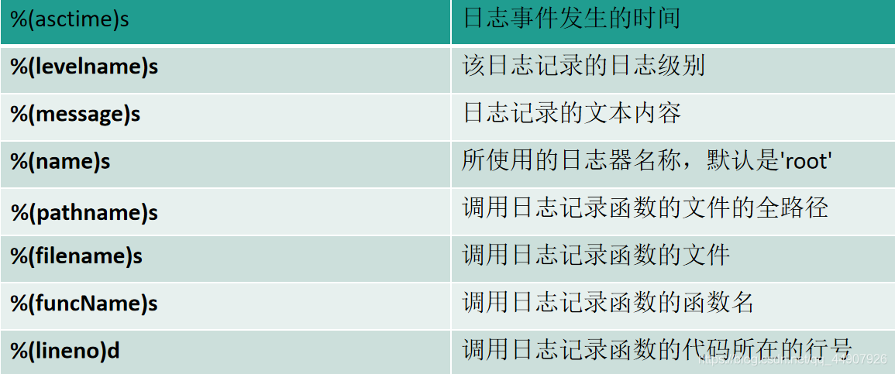
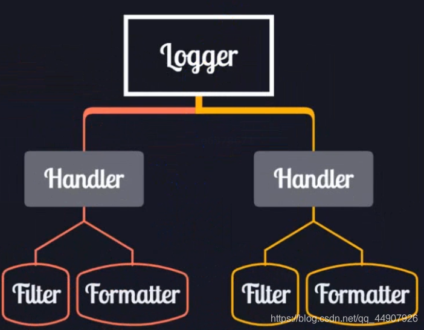

<!-- @import "[TOC]" {cmd="toc" depthFrom=1 depthTo=6 orderedList=false} -->

<!-- code_chunk_output -->

- [Python 错误处理](#python错误处理)
  - [logging 模块记录错误信息](#logging模块记录错误信息)
    - [配置日志](#配置日志)
    - [设置日志级别](#设置日志级别)
    - [创建日志记录器](#创建日志记录器)
    - [记录日志](#记录日志)
    - [日志旋转](#日志旋转)
    - [综合示例](#综合示例)

<!-- /code_chunk_output -->

# Python 错误处理

## logging 模块记录错误信息

`logging` 模块提供了灵活的方式来输出日志信息，这些日志信息可以用于监控程序的运行状态、调试程序或记录重要的事件。

```py
# err_logging.py
import logging
def foo(s):
    return 10 / int(s)
def bar(s):
    return foo(s) * 2
def main():
    try:
        bar('0')
    except Exception as e:
        logging.exception(e)
main()
print('END')
```

### 配置日志

可以通过 `logging.basicConfig()` 方法配置日志系统，设置日志级别、日志文件、日志格式等。

```python
logging.basicConfig(level    = logging.DEBUG,
                    format   = '%(asctime)s - %(levelname)s - %(message)s',
                    datefmt  = '%Y-%m-%d %H:%M:%S',
                    filename = 'app.log',
                    filemode = 'w' )
```



- `level` : 设置日志级别，如 DEBUG, INFO, WARNING, ERROR, CRITICAL。
- `format` : 设置日志的输出格式。
- `datefmt` : 设置日期时间格式。
- `filename`: 设置日志输出到文件的文件名。
- `filemode`: 设置文件打开模式，'w' 表示写模式，'a' 表示追加模式。

### 设置日志级别

日志级别从低到高分为：DEBUG, INFO, WARNING, ERROR, CRITICAL。

```python
logging.debug("这是一个 debug 级别的日志")
logging.info("这是一个 info 级别的日志")
logging.warning("这是一个 warning 级别的日志")
logging.error("这是一个 error 级别的日志")
logging.critical("这是一个 critical 级别的日志")
```

### 创建日志记录器

|           组件           |                                   说明                                   |
| :----------------------: | :----------------------------------------------------------------------: |
|  Loggers（日志记录器）   | 提供程序直接使用的接口（基操中的 logging.basicConfig()就是配置了此组件） |
|  Handlers（日志处理器）  |           将记录的日志发送到指定的位置（终端打印/保存为文件）            |
|  Filters（日志过滤器）   |                          用于过滤特定的日志记录                          |
| Formatters（日志格式器） |                        用于控制日志信息的输出格式                        |


可以创建自己的日志记录器，以便在不同的模块中使用。

```python
logger = logging.getLogger('my_logger')
logger.setLevel(logging.DEBUG)

# 创建一个文件处理器，并设置级别为 debug
file_handler = logging.FileHandler('my_logger.log')
file_handler.setLevel(logging.DEBUG)

# 创建一个流处理器（控制台输出），并设置级别为 error
stream_handler = logging.StreamHandler()
stream_handler.setLevel(logging.ERROR)

# 定义日志格式
formatter = logging.Formatter('%(asctime)s - %(name)s - %(levelname)s - %(message)s')
file_handler.setFormatter(formatter)
stream_handler.setFormatter(formatter)

# 将处理器添加到日志记录器
logger.addHandler(file_handler)
logger.addHandler(stream_handler)
```

### 记录日志

使用创建的日志记录器记录日志。

```python
logger.debug("这是一个 debug 级别的日志")
logger.info("这是一个 info 级别的日志")
logger.warning("这是一个 warning 级别的日志")
logger.error("这是一个 error 级别的日志")
logger.critical("这是一个 critical 级别的日志")
```

### 日志旋转

可以使用 `RotatingFileHandler` 来实现日志文件的自动旋转。

```python
from logging.handlers import RotatingFileHandler

# 创建一个日志旋转处理器
rotating_handler = RotatingFileHandler('rotate.log', maxBytes=1024*1024*5, backupCount=3)
rotating_handler.setLevel(logging.DEBUG)
rotating_handler.setFormatter(formatter)

# 将旋转处理器添加到日志记录器
logger.addHandler(rotating_handler)
```

- `RotatingFileHandler`: 当日志文件达到指定大小时，会自动进行旋转，生成新的日志文件。
- `maxBytes`: 每个日志文件的最大字节数。
- `backupCount`: 保留日志文件的数量。

### 综合示例

```python
import logging

# 配置日志
logging.basicConfig(level=logging.DEBUG,
                    format='%(asctime)s - %(levelname)s - %(message)s',
                    datefmt='%Y-%m-%d %H:%M:%S',
                    filename='app.log',
                    filemode='a')

# 创建日志记录器
logger = logging.getLogger('my_logger')
logger.setLevel(logging.DEBUG)

# 创建一个文件处理器，并设置级别为 debug
file_handler = logging.FileHandler('my_logger.log')
file_handler.setLevel(logging.DEBUG)

# 创建一个流处理器（控制台输出），并设置级别为 error
stream_handler = logging.StreamHandler()
stream_handler.setLevel(logging.ERROR)

# 定义日志格式
formatter = logging.Formatter('%(asctime)s - %(name)s - %(levelname)s - %(message)s')
file_handler.setFormatter(formatter)
stream_handler.setFormatter(formatter)

# 将处理器添加到日志记录器
logger.addHandler(file_handler)
logger.addHandler(stream_handler)

# 记录日志
logger.debug("这是一个 debug 级别的日志")
logger.info("这是一个 info 级别的日志")
logger.warning("这是一个 warning 级别的日志")
logger.error("这是一个 error 级别的日志")
logger.critical("这是一个 critical 级别的日志")
```

通过使用 `logging` 模块，你可以方便地记录程序的运行状态和调试信息，有助于程序的维护和问题排查。
