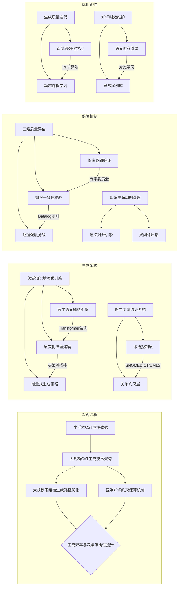
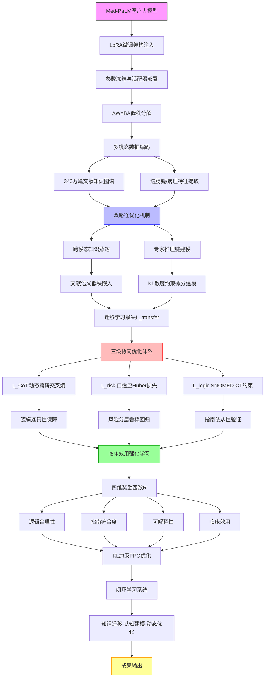

<!--
 * @Author: feng 1804831168@qq.com
 * @Date: 2025-02-14 21:30:40
 * @LastEditors: feng 1804831168@qq.com
 * @LastEditTime: 2025-02-16 16:35:51
 * @Description:
 * Copyright (c) 2025 by Feng, All Rights Reserved.
-->

