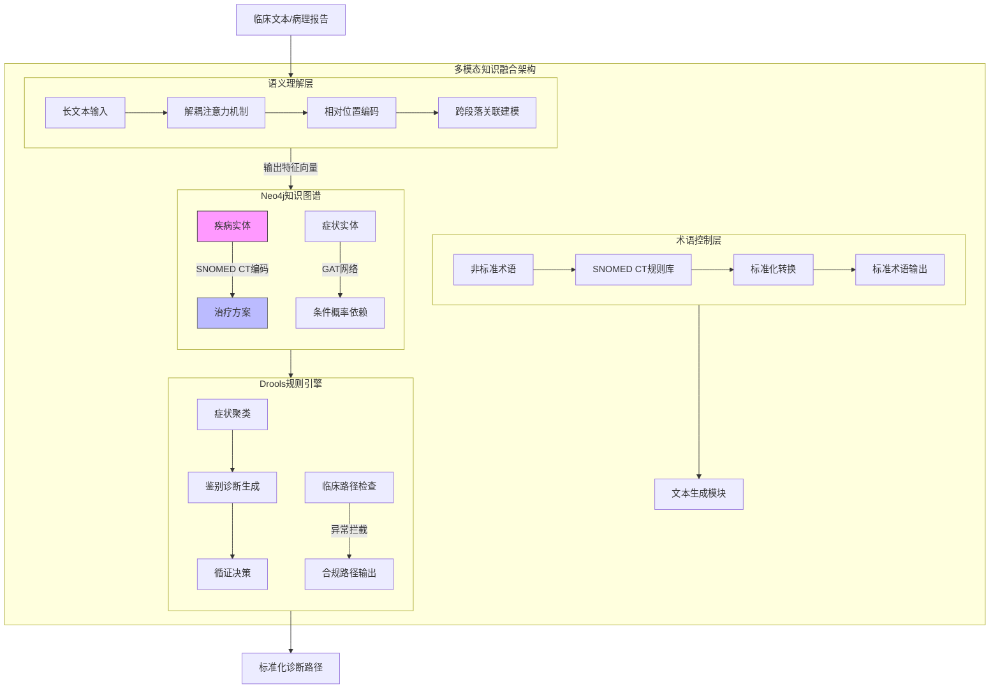

```mermaid
flowchart TD
    subgraph 多模态知识融合架构
        direction TB

        语义理解层[DeBERTa-v3语义理解层] -->|输出特征向量| 知识图谱构建层
        知识图谱构建层 --> 决策引擎层
        术语控制层 --> 文本生成模块

        subgraph 语义理解层
            direction LR
            A[长文本输入] --> B[解耦注意力机制]
            B --> C[相对位置编码]
            C --> D[跨段落关联建模]
        end

        subgraph 知识图谱构建层[Neo4j知识图谱]
            direction TB
            E[疾病实体] -->|SNOMED CT编码| F[治疗方案]
            G[症状实体] -->|GAT网络| H[条件概率依赖]
            style E fill:#f9f,stroke:#333
            style F fill:#bbf,stroke:#666
        end

        subgraph 术语控制层
            direction LR
            I[非标准术语] --> J[SNOMED CT规则库]
            J --> K[标准化转换]
            K --> L[标准术语输出]
        end

        subgraph 决策引擎层[Drools规则引擎]
            direction TB
            M[症状聚类] --> N[鉴别诊断生成]
            N --> O[循证决策]
            P[临床路径检查] -->|异常拦截| Q[合规路径输出]
        end
    end

    输入数据[临床文本/病理报告] --> 语义理解层
    决策引擎层 --> 输出结果[标准化诊断路径]
```

