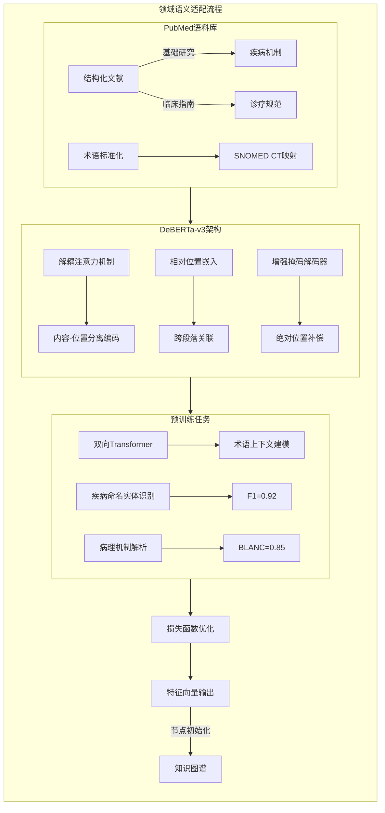

<!--
 * @Author: feng 1804831168@qq.com
 * @Date: 2025-02-19 13:37:59
 * @LastEditors: feng 1804831168@qq.com
 * @LastEditTime: 2025-02-19 13:38:15
 * @Description: 
 * Copyright (c) 2025 by Feng, All Rights Reserved. 
-->

