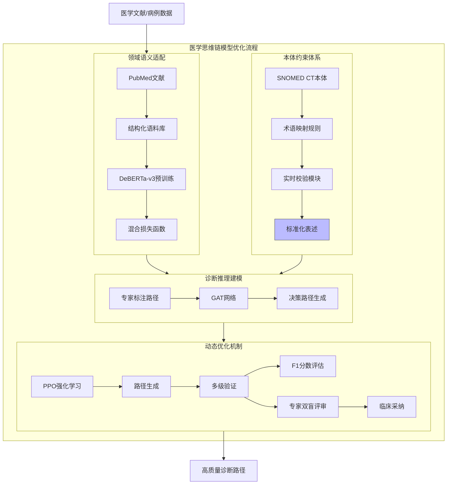

```mermaid
flowchart TD
subgraph 医学思维链模型优化流程
direction LR

        领域适配 --> 推理建模
        推理建模 --> 生成验证
        术语控制 --> 推理建模
        subgraph 领域适配[领域语义适配]
            direction TB
            A[PubMed文献] --> B[结构化语料库]
            B --> C[DeBERTa-v3预训练]
            C --> D[混合损失函数]
        end

        subgraph 推理建模[诊断推理建模]
            direction LR
            F[专家标注路径] -->  H[GAT网络]
            H --> I[决策路径生成]

        end

        subgraph 术语控制[本体约束体系]
            direction TB
            K[SNOMED CT本体] --> L[术语映射规则]
            L --> M[实时校验模块]
            M --> N[标准化表述]
            style N fill:#bbf,stroke:#666
        end

        subgraph 生成验证[动态优化机制]
            direction LR
            O[PPO强化学习] --> P[路径生成]
            P --> Q[多级验证]
            Q --> R[F1分数评估]
            Q --> S[专家双盲评审]
            S --> T[临床采纳]
        end
    end

    输入数据[医学文献/病例数据] --> 领域适配
    生成验证 --> 输出成果[高质量诊断路径]


```
