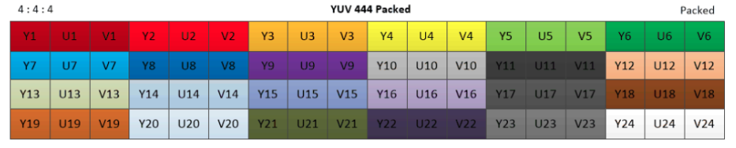
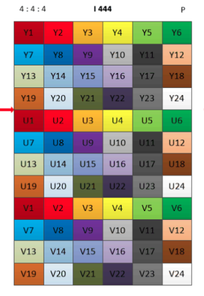
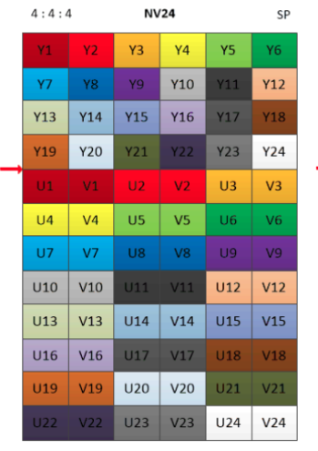

# YUV
YUV[^YUV格式参考地址]是指亮度参量和色度参量分开表示的像素格式，其中“Y”表示明亮度（Luminance或Luma），也就是灰度值；
而“U”和“V”表示的则是色度（Chrominance或Chroma），作用是描述影像色彩及饱和度，用于指定像素的颜色。
- Y: 表示明亮度(Luminance或Luma)
- U和V: 色度(Chrominance或者Chroma), 作用是描述影像色彩及饱和度，用于指定像素的颜色。

## YCbCr
其中Y是指亮度分量，Cb指蓝色色度分量，而Cr指红色色度分量。
YCbCr 则是在世界数字组织视频标准研制过程中作为ITU - R BT.601 建议的一部分，其实是YUV经过缩放和偏移的翻版。其中Y与YUV 中的Y含义一致,Cb,Cr 同样都指色彩，只是在表示方法上不同而已。在YUV 家族中，YCbCr 是在计算机系统中应用最多的成员，其应用领域很广泛，JPEG、MPEG均采用此格式。一般人们所讲的YUV大多是指YCbCr。YCbCr 有许多取样格式，如4∶4∶4,4∶2∶2,4∶1∶1 和4∶2∶0。

## YUV 采样
色度通道的采样率可以低于亮度通道，而不会显著降低感知质量。
4:4:4 表示完全取样。
4:2:2 表示2:1的水平取样，垂直完全采样。
4:2:0 表示2:1的水平取样，垂直2：1采样。
4:1:1 表示4:1的水平取样，垂直完全采样。

## YUV 4:4:4
完全取样，每个像素都有独立的Y/U/V值

## YUV 4:2:2
两个Y共用一对U/V值

## YUV 4:2:0
每四个Y共用一对U/V值

## YUV 4:1:1
与YUV 4:2:0类似，都是四个每四个Y共用一对U/V值，区别是4:1:1是水平方向的4个Y共享一对U/V，如下图所示，第1-4个Y使用同一对U/V值，第5-8个Y使用同一对U/V值，依次类推。。。

## 排列格式
### Packed (or Interleaved)
三个分量全部交错存储,存储完第一个像素的YUV再存储第二个像素的。

### Planar
将 YUV444 采样数据的YUV三个分量分别存储，如下图：先存储所有的Y分量，然后存储U分量，最后存储V分量。

### Semi-Planar
将 Y 分量单独存放，UV 分量交错存储。如下图：先存储所有的Y分量，然后UV 分量交错存储，UV排列时先存U分量。

## YUV 与 RGB 相互转换[^2]
一般来讲，我们把YUV、Y‘UV、YCbCr, YPbPr包含在YUV颜色模型的范围内，其中Y都表示亮度，UV表示两个色度分量，但是具体的颜色模型的用途又各不相同，当然，他们与RGB的互转公式也就不相同。在电视系统发展的早期，YUV和Y’UV都是颜色信息的模拟信号编码形式，虽然Y和Y’都表示亮度，但是两种亮度的意义却天差地别，Y用来代指luminance,表示的是自然颜色的亮度，而Y‘代指luma，表示的是经过伽马压缩之后电信号的强度。在现在的计算机系统中，YUV一般用来代指YCbCr,用来表示文件的编码格式，用于数字视频的编码，而YPbPr颜色模型常常用在模拟分量视频中。所以YUV颜色模型到RGB颜色模型的转换，应该对应两种方式，分别是模拟YUV->模拟RGB、数字YUV->数字RGB。不过因为标清、高清、以及超清幅面，YUV转RGB的权重值各不相同，需要将模拟信号和数字信号再做一次幅面划分，就出现了6种转换公式。

#### BT.601：
Kr = 0.299 
Kg = 0.587 
Kb = 0.114

#### BT.709:
Kr = 0.2126 
Kg = 0.7152 
Kb = 0.0722

#### BT.2020:
Kr = 0.2627 
Kg = 0.678 
Kb = 0.0593

### 模拟 RGB--->YUV
Kr + Kb +Kg = 1
Umax = Vmax = 0.5

Y = Kr * R + Kg * G + Kb * B
Pb = Umax * (B - Y) / (1 - Kb)
Pr = Vmax * (R - Y) / (1 - Kr)

### 数字 RGB--->YUV
Kr + Kb +Kg = 1
Umax = Vmax = 0.5

Y = 16 + 219 * (Kr * R + Kg * G + Kb * B) / 255
Cb = 128 + 224 * (Umax * (B - Y) / (1 - Kb)) / 255
Cr = 128 + 224 * (Vmax * (R - Y) / (1 - Kr)) / 255

## YUV计算文件大小
已知YUV采样率、分辨率、和帧数
文件大小=宽 * 高 * 采样率 * 向上取整(位深/8) * 帧数
file size(byte) = width * height * rate * Ceil(bitdepth/8) * frames
以最常用的nv12/i420等8bit位深的420为例
文件大小 = 宽 * 高 * 1.5 * 帧数

## YUV计算帧数
YUV帧数的计算和文件大小的计算类似
要求已知文件大小、采样率、分辨率
YUV帧数=文件大小/(宽 * 高 * 采样率 * 向上取整(位深/8))
YUV frames = file size(byte) / (width * height * rate * Ceil(bitdepth/8))

[^YUV格式参考地址]: [YUV格式参考地址](https://blog.csdn.net/wkd_007/article/details/141218195#:~:text=YUV%E6%9C%89%E4%B8%89%E7%A7%8D%E5%AD%98%E5%82%A8%E6%A0%BC%E5%BC%8F%EF%BC%9A%20Planar%20%E6%A0%BC%E5%BC%8F%EF%BC%88%E5%B9%B3%E9%9D%A2%E6%A0%BC%E5%BC%8F%EF%BC%89%EF%BC%9AY%E3%80%81U%E3%80%81V%20%E4%B8%89%E4%B8%AA%E5%88%86%E9%87%8F%E5%88%86%E5%88%AB%E5%AD%98%E5%82%A8%E3%80%82%20Semi-Planar,%E6%A0%BC%E5%BC%8F%EF%BC%88%E5%8D%8A%E5%B9%B3%E9%9D%A2%E6%A0%BC%E5%BC%8F%EF%BC%89%EF%BC%9AY%20%E5%88%86%E9%87%8F%E5%8D%95%E7%8B%AC%E5%AD%98%E6%94%BE%EF%BC%8CUV%20%E5%88%86%E9%87%8F%E4%BA%A4%E9%94%99%E5%AD%98%E5%82%A8%E3%80%82%20Packed%20%E6%A0%BC%E5%BC%8F%EF%BC%88%E6%89%93%E5%8C%85%E6%A0%BC%E5%BC%8F%EF%BC%89%EF%BC%9A%E4%B8%89%E4%B8%AA%E5%88%86%E9%87%8F%E5%85%A8%E9%83%A8%E4%BA%A4%E9%94%99%E5%AD%98%E5%82%A8%E3%80%82)

[^2]:[转换公式参考](https://blog.csdn.net/xkuzhang/article/details/115423061)
